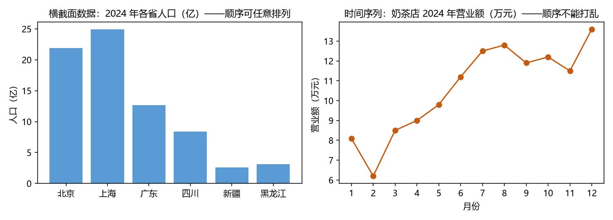

# 第 1 章 · 时间序列是什么：从身边的数据开始

**本章目标**：学完本章后，你能①从任意数据中识别出"这是不是时间序列"；②说出时间序列区别于其他数据的三个根本特征；③拿到一串时间序列数据时，知道第一步该做什么、为什么。

---

## 1.1 动机：先看一个你每天都在生产的例子

假设从今天开始，你每天早上起床后测一次体重，记在本子上：

| 日期 | 体重（kg） |
|---|---|
| 周一 | 70.2 |
| 周二 | 70.5 |
| 周三 | 70.1 |
| 周四 | 70.8 |
| … | … |

这串数字看起来平淡无奇，但它有**三个特点**是任何普通清单都没有的：

1. **顺序有意义**：周一的 70.2 和周四的 70.8 顺序不能对调——因为它们是"按时间先后"发生的，顺序对调后，"体重随时间怎么变"这个故事就彻底毁了。
2. **相邻数字有关联**：如果你昨天 70.5，今天大概率还在 70 附近，而不是突然跳到 90。昨天的数值"约束"着今天。
3. **整体还会缓慢变化**：长期看，体重会随生活节奏与季节慢慢漂移（比如冬天容易长肉）。这一点现在只是提个醒，1.2.3 节会正式展开。

凡是具备这三个特点的数据，就叫**时间序列（time series）**：**按时间顺序排列的、前后相互关联的观测值**。

> 类比：普通数据像"一袋弹珠"——每颗弹珠独立，你随便抓出哪颗都不影响别的。时间序列像"一条铁链"——每一环都和上一环扣在一起，顺序不能乱，你只能从一头往另一头看。

本章余下内容回答三个问题：时间序列到底由什么构成（1.2）？它和别的数据差在哪（1.3）？拿到一串序列，第一步做什么（1.4–1.5）？以及这个环节会踩的坑（1.6）和这些坑历史上怎么被解决的（1.7）。

---

## 1.2 是什么：拆开"时间序列"这个词

### 1.2.1 三个要素

任何一个时间序列都可以拆成三样东西：

- **观测值（observation）**：记录下来的数字。上面的 70.2、70.5 就是观测值。我们通常用一个字母表示它，比如 `x`。
- **时间索引（time index）**：这个数字是"哪个时刻"的。我们用下标表示，比如 `x₁` 表示第 1 个时刻的观测，`x₂` 表示第 2 个时刻的观测。整个序列写作：

```
x₁, x₂, x₃, …, x_T
```

  读作"x 一、x 二、…、x T"，表示一共记录了 T 个时刻（T 是总长度；它和前面的小写下标是同一回事，只是字体不同）。

- **采样间隔（sampling interval）**：相邻两个时刻之间隔了多久。上面例子是"1 天"；也可以是 1 小时、1 毫秒、1 年。**间隔决定了你能看到什么**：用日数据看不出"秒级波动"，用秒数据又会被噪声淹没。我们后面会反复遇到"尺度"问题。

### 1.2.2 一句话定义

> **时间序列 = 同一变量按时间顺序、前后相互关联地记录的观测集合**（最常见的形态是等间隔记录）。

注意这个定义保留了 1.1 提到的"前后相互关联"——正是这一点把时间序列和普通清单区分开。

"同一变量"很重要：体重序列里只能有体重，如果你把"体重、身高、鞋码"混在一张表里按时间排，那是三串序列，不是一串。

### 1.2.3 三个根本特征（务必背下来）

前面例子已经暗示了，这里明确列出。这三个特征**决定了后面所有方法为什么那样设计**：

1. **时间的方向性（不可逆）**：时间只能从过去流向未来。今天能影响明天，明天不能影响今天。推论：**预测只能向后**；且序列**不能随机打乱顺序**。
2. **相邻相关（自相关，autocorrelation）**：相邻观测相互依赖。推论：**普通统计"样本独立"的假设在这里不成立**（独立＝这条数字与那条数字互不影响、互不约束），需要专门工具。
3. **非平稳（non-stationarity）是常态**：均值会漂移（体重长期缓慢上升，但每天只有小波动）、波动会变化（股市一会儿平静一会儿剧烈）、季节会切换。推论：**"老老实实不动"的序列是特例，动不动才正常**——后面几乎所有方法都在和"动"搏斗。（"平稳"＝序列"老实"：平均水平、波动大小这类特征长期不变。第 4 章给出严格定义。）

### 1.2.4 不同维度的分类

| 维度 | 类型 | 例子 |
|---|---|---|
| 变量个数 | 单变量（一个变量） / 多变量（多个变量同时记录） | 只有气温 / 气温+湿度+风速 |
| 时间索引 | 离散（按时点） / 连续（实时信号） | 按天记录 / 心电图连续波形 |
| 采样间隔 | 等间隔 / 不等间隔 | 每小时 / 病人随机来就诊的时间 |
| 结构 | 有趋势、有季节 / 无明显结构 | 逐年上升的销售额 / 白噪声——完全随机、前后无关的序列（见第 4 章） |

现在不需要记住所有类别，只需要知道：**不同形态的序列要用不同工具**，所以拿到数据先搞清楚"它是哪种"。

---

## 1.3 它和"普通数据"差在哪：三个对照

普通统计课学的是**横截面数据（cross-sectional data）**：同一时刻、多个对象。比如"2024 年 12 月 31 日全国 34 个省级行政区的人口"——每个省一个数字，省与省之间没有天然顺序。

对照表：

| 问题 | 横截面数据 | 时间序列数据 |
|---|---|---|
| 顺序 | 可任意排列 | 必须按时间排 |
| 样本独立？ | 假设独立 | **相邻相关，不独立** |
| 分析目标 | 比较对象差异 | 描述演变、预测未来 |
| 训练/测试怎么切 | 随机抽样 | **必须按时间切**（见 1.6 与 1.7） |

还有一种中间形态叫**面板数据（panel data）**：多个对象 × 多个时刻，比如"34 个省 × 10 年 × GDP"。它本质上是"很多条时间序列并排"，处理时既用时间方法也用横截面方法。

（注：表格里"训练/测试"是机器学习的概念——训练集＝用来"学"规律的历史数据；测试集＝学完后用来检验效果的新数据。第 13 章正式展开。）

> 一句话记法：**横截面看"人跟人比"，时间序列看"今天跟昨天比"，面板是两者叠加。**



*图 1.1 左：横截面数据（各省人口，顺序可任意排列）；右：时间序列（奶茶店营业额，顺序不能打乱）。*

---

## 1.4 怎么做（第一步）：拿到数据先别建模，先"看"

零基础者最常见的冲动是：拿到数据立刻套公式、跑模型。这是错的。**建模前必须做四件事**，每一件都有明确理由和效果。

### 第 1 步：画图（时序图）

- **做什么**：横轴是时间，纵轴是数值，把 `x₁…x_T` 连成一条折线。
- **为什么**：人眼是最强的模式识别器。趋势、季节、异常点、波动变化，画出来一眼就能看到；不画图直接建模，等于蒙眼开车。
- **会怎样**：你会立刻看到序列的"长相"——上升/下降/波浪形/乱成一团。这一眼比任何统计检验都更快地告诉你后面该用什么方法。

### 第 2 步：核对时间戳与间隔

- **做什么**：确认每一条数据对应哪个时刻，间隔是否真的相等。
- **为什么**：很多"看起来"等间隔的数据实际不是——节假日没数据、闰年多一天、夏令时跳一小时（部分国家夏季把钟表拨快一小时）、传感器随机断线。如果间隔不均却当均等处理，模型的"第 t 步"就对应错了真实时间。
- **会怎样**：你会在早期就发现缺失和间隔问题，而不是等模型跑完才莫名奇妙地失败。

### 第 3 步：用眼睛找三样东西

- **做什么**：看有没有 ①长期上升/下降（趋势 trend）；②固定周期的起伏（季节 seasonality）；③忽大忽小的波动（波动性变化）。
- **为什么**：这三样东西对应三种不同的建模手段。先判断"有什么"，才能选"用什么"。
- **会怎样**：你会得到一张"结构清单"（例如：有上升趋势 + 每年冬季高峰），第 2 章会教你如何正式分解它们。

### 第 4 步：查缺失、异常与单位

- **做什么**：数一数缺失多少、有没有离谱的极大极小值（比如气温 500°C）、单位是什么（摄氏度还是华氏度？万元还是元？）。
- **为什么**：缺失和异常会扭曲一切后续统计量（均值＝平均水平；方差＝波动大小；模型参数＝公式里的系数）；单位错了则结论全部作废。
- **会怎样**：你建立了对数据质量的判断，知道后面哪一步需要插补、哪一步需要清洗。

> 这四步合起来就是一句行话：**"先画图、再查数、后建模。"**

---

## 1.5 完整示例：一张 12 个月的"小店营业额"表

假设某奶茶店记录了 2024 年 1–12 月营业额（万元）：

```
1月 2月 3月 4月 5月 6月 7月 8月 9月 10月 11月 12月
8.1 6.2 8.5 9.0 9.8 11.2 12.5 12.8 11.9 12.2 11.5 13.6
```

按 1.4 的四步走：

1. **画图**：连线后你会看到——整体逐步上升（1 月 8.1 → 12 月 13.6），中间有小起伏，2 月明显偏低。
2. **核对间隔**：按月，等间隔，无缺失。✔
3. **找结构**：①趋势：逐步上升（1 月 8.1 → 12 月 13.6）；②疑似季节：2 月低谷——很可能是春节效应（客流少、部分时段歇业），但只有一年数据，还不能确认它是否每年固定重复；③波动：相对平稳。
4. **查异常**：2 月的 6.2 是"异常"吗？——不是错误，是春节效应。**"异常"有两种：错误（要修）与真实信号（要建模）**，这一步的判断很重要。

**效果**：现在你已经知道——"这个序列有上升趋势 + 2 月季节低谷"，这就是第 2 章分解、第 8 章 SARIMA 建模的起点。**你还没做任何数学，就已经得到了信息量最大的结论。**

---

## 1.6 这个环节可能遇到的问题（陷阱清单）

这里集中列出"识别与观察时间序列"阶段最常犯的错。**这些错误不是小事，历史上都曾导致过著名的失败**（见 1.7）。

1. **把时间序列当独立样本**：直接算两个序列的相关系数（衡量两序列同向变化程度的数，取值 −1~1）、直接做普通回归，不检验自相关。后果：得到"显著但虚假"的关系（伪相关/伪回归）。
2. **打乱顺序或随机划分训练/测试**：把第 1、5、9 月放训练集，第 2、6、10 月放测试集。后果：模型"偷看"了未来，测试分数虚高，上线后实际表现暴跌（这叫**数据泄漏**，见第 13 章详述）。
3. **忽略非平稳直接算统计量**：对逐年上升的序列直接算均值、方差，或直接回归（回归＝用一条公式拟合数据关系的做法）。后果：均值无意义（年年不同）、回归系数被"共同趋势"欺骗。
4. **默认等间隔**：有缺失、有假期却不处理。后果：模型的时间语义错乱，预测对不上真实日历。
5. **把"相关"当"因果"**：冰淇淋销量与溺水人数高度相关（都随夏天上升），但冰淇淋不导致溺水。时间序列里这种"同趋势导致的假相关"比比皆是。
6. **过度清洗真实信号**：把 2 月的 6.2 当错误删掉。后果：把真实季节信号洗没了，模型永远学不会春节效应。

> 观察阶段的原则：**宁可多问"为什么"，不要急着算**；**异常先分"错误"与"信号"两类**。

---

## 1.7 相似问题与已有解决方案：历史回响

这一小节是本书的特色：**每个环节的困难，历史上大多遇到过相似问题，并且已有解决方案。** 你踩的坑，前人几乎都踩过。

| 本章遇到的困难 | 谁遇到过 | 怎么解决的 | 本书对应章节 |
|---|---|---|---|
| "忽略顺序，相关关系虚假" | Yule 1926 发现两个独立但自相关的序列相关高达 0.8+（nonsense correlation） | 用**自相关检验**和专门时序模型取代朴素相关/回归 | 第 4、7 章 |
| "打乱顺序导致泄漏" | 机器学习界 2010s 反复翻车 | 制定**时序切分协议**（rolling window，见第 13 章） | 第 13、19 章 |
| "不等间隔数据" | 天文观测（几百年才有一次日食）与医学随访 | **重采样对齐**；或使用**连续时间模型**（卡尔曼滤波、神经 ODE、高斯过程） | 第 9、16 章 |
| "相关≠因果" | 计量经济学 20 世纪中期的争论 | 发展出**格兰杰因果检验、工具变量、因果推断**方法 | 第 11、19 章 |
| "有趋势的两个序列必然相关" | 计量经济学家发现"共同漂移"现象 | **协整分析**（Engle & Granger 1987）区分"真均衡"与"假相关" | 第 11 章 |

（说明：1.7 表格第一行里"独立"指两个序列彼此无关；"自相关"指每个序列内部前后相关——是两回事，可以同时成立，所以"独立但自相关"并不矛盾。）

**核心启示**：你现在觉得的"我的数据好乱"，绝大多数是**已被研究过的问题**——本书每一章都会在结尾给你这样一张"问题→答案"的映射表，让你知道：*这不是你的错，这是学科的历史；而且大部分坑已经有桥。*

---

## 1.8 本章小结

1. 时间序列 = 按时间排列、前后相关的观测集合；三要素是观测值、时间索引、采样间隔。
2. 三个根本特征：**方向性、自相关、非平稳**——它们决定了后面所有方法的设计。
3. 它区别于横截面数据：**顺序不能乱、样本不独立、必须按时间切分**。
4. 拿到数据第一步不是建模，而是**画图 → 查间隔 → 找趋势/季节/波动 → 查缺失异常**。
5. 观察阶段的大坑：伪相关、数据泄漏、忽略非平稳、把信号当噪声；**这些坑前人基本都踩过且已有解法**。

下一章我们把"趋势、季节、噪声"从定性变成定量——学会把一条序列正式拆开（第 2 章 · 拆解时间序列）。

---

## 1.9 练习与自测

1. ★ 判断正误并解释：*"时间序列可以随机打乱顺序后做分析。"*（提示：1.2.3 特征 1）
2. ★ 下面哪些是时间序列？①全班同学的期末成绩；②北京过去 100 天每天的最高气温；③你手机里按时间排序的 100 条短信长度；④2020–2024 年五个城市的 GDP。对非时序的说明为什么。（提示：1.3）
3. ★★ 给你一串"每日气温"数据，按 1.4 的四步列出你的行动计划，并说明每一步的理由。（提示：1.4 每步的"为什么"）
4. ★★ 一家商店的日销售额数据里，周日总为 0（系统故障），你打算直接删掉周日？为什么？（提示：1.5 第 4 步 + 1.6 第 4 条，并想想与第 6 条的区别）
5. ★★★ 上网查 Yule 1926 年"nonsense correlation"论文（关键词：Yule 1926 nonsense correlation），用一段话说明他发现了什么、为什么这动摇了"直接回归"的做法。（提示：1.7 表格第一行）

**简答提示**：1 错；2 ②是；④严格说是面板数据（5 城 × 5 年），本质是 5 条时间序列并排，可算"是"但要意识到它是多条不是一条；③是时间序列（按发生时间记录），但它不满足本章强调的"前后相关"——短信长度彼此独立——所以顺序信息的作用很弱；3 画图（人眼识别趋势/季节）→核对间隔（防止时间语义错乱）→找结构（决定用什么方法）→查异常（区分错误与真实信号）；4 不要。周日 0 是错误（系统故障）而非真实信号，应修复——插补（用合理值填上缺失位置，本书后续章节系统介绍）——直接删会破坏周周期。注意与 1.6 第 6 条区分：那条是"真实信号别删"，本例是"错误所以要修"；5 Yule 用两个独立自相关序列演示了虚假高相关。

---

## 1.10 本章审阅记录

（本章写完后的审阅将在此填写：审阅日期、逐项对照 R1–R8 的结论、发现的问题与修订。）

| 审阅项 | 结论 | 问题与修订 |
|---|---|---|
| R1 零基础可理解性 | ✔ 通过（修订后） | 子代理指出 8 处术语未解释（独立、均值、方差、相关系数、回归、训练/测试、插补、夏令时）与定义矛盾，已全部补括号注释并统一定义；"平稳"改用人话解释 |
| R2 为何行动 | ✔ 通过 | 1.4 每步均有"为什么"；子代理指出 1.5 春节效应缺因果动机，已补（客流少/歇业） |
| R3 效果明确 | ✔ 通过 | 1.4 每步均有"会怎样"；1.5 明确"你还没做任何数学就已得到结论" |
| R4 陷阱覆盖 | ✔ 通过 | 6 条陷阱均有文献/公认教训依据（Yule、泄漏、伪回归等） |
| R5 相似问题映射 | ✔ 通过 | 5 行映射表；补了"独立 vs 自相关"说明消除表面矛盾 |
| R6 示例可复现 | ✔ 通过 | 奶茶店示例数字自洽；子代理指出"缓慢上升"名不副实，已改为"逐步上升" |
| R7 章节衔接 | ✔ 通过 | 开头承接第 0 章语境，结尾预告第 2 章 |
| R8 练习有效 | ✔ 通过 | 修订练习 2（④面板归属）、3（补理由）、4（提示指向相反问题）答案，消除自相矛盾 |

**审阅方式**：作者自查 + 独立"模拟零基础读者"子代理通读（反馈 15 条：严重 3、中等 6、轻微 6），全部处理；严重问题均已修订，无遗留。
