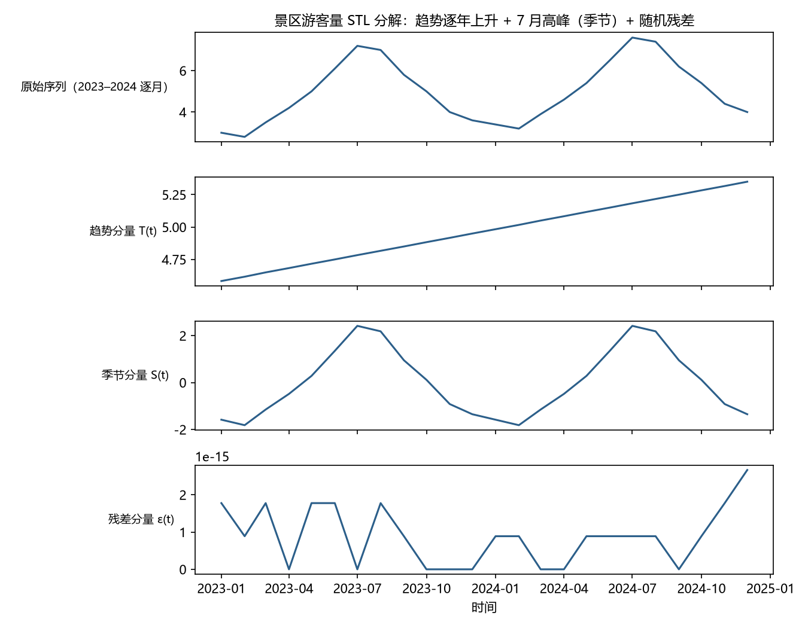

# 第 2 章 · 拆解时间序列：趋势、季节、循环与噪声

**本章目标**：学完本章后，你能①说出时间序列的四个成分及"加法/乘法"两种组合方式；②用手算完成一次移动平均与季节均值分解；③解释 STL 分解比前两者强在哪；④诊断分解是否成功。

---

## 2.1 动机：从"用眼睛看"到"用计算拆"

第 1 章结束时，我们对奶茶店数据只能做定性描述："有上升趋势、2 月偏低"。这一章把它变成**定量拆解**：把一条序列正式拆成几个可解释的部分。为什么要拆？

1. **可解释**：决策者要的不是一个预测数字（比如第 1 章奶茶店 12 月的 13.6 万），而是"因为趋势每年涨 3%、又赶上 12 月旺季，所以是 13.6 万"。分解让预测有故事。
2. **建模前置**：把"趋势 + 季节 + 噪声"混在一起建模，模型要同时学三件事，容易顾此失彼；**先拆开、分别处理**要容易得多。后面第 8 章的 SARIMA、第 15 章的 Autoformer 都以分解为起点——分解思想贯穿全书。
3. **异常检测**：拆掉趋势和季节后剩下的**残差**里如果突然出现大值，那就是异常（比如设备故障、数据错误）。残差是"照妖镜"。

> 先记住一句话：**分解 = 把"为什么这么动"从数据里拎出来，把"说不清的部分"留作残差。**

---

## 2.2 是什么：四个成分与两种组合方式

### 2.2.1 四个成分

| 成分 | 定义 | 特征 | 例子 |
|---|---|---|---|
| **趋势 T(t)**（trend） | 长期、缓慢、单向的变化 | 时间尺度最长 | GDP 逐年增长、气温百年上升 |
| **季节 S(t)**（seasonality） | 固定周期的反复波动 | 周期**已知且不变**（24 小时、7 天、12 个月） | 每天早高峰、12 月购物潮 |
| **循环 C(t)**（cycle） | 周期不固定或很长的起伏 | 周期**未知或可变** | 5~8 年的经济景气循环 |
| **噪声 ε(t)**（noise） | 扣除前三者后的随机波动 | 无结构 | 测量误差、不可预测的随机冲击 |

（补充：季节的周期不一定是"年"——一天 24 小时、一周 7 天这类固定可预知的周期都算"季节"。）

**季节 vs 循环的区分是本章的必考点**：季节的周期你提前就知道（日历告诉你的），循环的周期你不知道（要数据告诉你）。比如"每年 12 月高"是季节；"每 6~10 年一次经济衰退"是循环。**趋势 vs 循环的区分**：趋势单向、不回头；循环来回摆——把它画出来，若会回到原来的水平就是循环，一路不回头才是趋势。

### 2.2.2 两种组合方式

- **加法模型**：`x(t) = T(t) + S(t) + C(t) + ε(t)`——各成分"相加"，单位相同。
- **乘法模型**：`x(t) = T(t) × S(t) × C(t) × ε(t)`——成分"相乘"，季节和噪声按比例作用。

**怎么选**：看**噪声的波动大小是否随水平变化**。

> 例子：一家小店淡季月销 100 件，上下波动 ±10 件；旺季月销 1000 件，上下波动 ±100 件。噪声从 ±10 变成 ±100——**波动大小跟着水平走**，这种"振幅随水平放大"的序列用乘法模型（或等价地，把每个数取对数后再用加法模型——对数能把"乘以 1.3"变成"加上 ln1.3"，所以乘法关系取对数后变成加法关系；第 3 章展开）。反过来，如果淡季旺季波动都是 ±10 件，就用加法。

判断口诀：**画图看"喇叭口"——波动随着水平升高而张开，就是乘法。**

### 2.2.3 一个必须有的清醒认识

> **分解不是"从数据里挖出真相"，而是"我们选择相信的一种解释"**。同一串数据，换一种分解方法会得到不同的趋势和季节。所以分解结果的**残差要接受诊断**（见 2.3 方法 C 第 6 步），残差越接近"纯随机"，这个分解就越可信。

---

## 2.3 怎么做：三种经典分解方法（逐步）

### 方法 A：移动平均（moving average）——估计趋势的最简单办法

**第 1 步 · 选窗口长度 k（通常取奇数）**
- **做什么**：决定一次平均多少个点。比如 k=3、k=5、k=12（月度数据一年）。偶数窗口（如 k=12）也能用，但需要额外做"居中"对齐，见 2.5 陷阱 2。
- **为什么**：平均能抵消随机噪声（正误差和负误差互相抵消）；如果窗口长度**覆盖整个季节周期**，季节波动也会在平均中被抹平——剩下的就是趋势。
- **会怎样**：k 越小，趋势线越"毛糙"（跟着噪声走）；k 越大，趋势线越"光滑"（但也可能把真实的拐点抹平）。

**第 2 步 · 逐点求平均**
- **做什么**：对第 t 个点，取它**前后各 (k−1)/2 个点**共 k 个点求平均，作为该点的趋势估计 T̂(t)。
- **为什么**：取前后对称，是为了让第 t 点的趋势估计"居中"、不偏不倚；若只取过去 k 个点，估计会整体滞后。
- **会怎样**：得到一条比原序列平滑得多的趋势线；代价是**首尾各损失 (k−1)/2 个点**没有估计。（注：这里取前后对称属于"居中"滤波，只用于事后描述与诊断；进入建模与预测必须只使用过去的点，见 2.5 陷阱 6。）

**数字示例（k=3，对 2.4 节景区数据）**：
```
原序列：3.0, 2.8, 3.5, 4.2, 5.0, …
T̂(2) = (3.0 + 2.8 + 3.5) / 3 = 3.10   ← 第 2 点的趋势
T̂(3) = (2.8 + 3.5 + 4.2) / 3 = 3.50
T̂(4) = (3.5 + 4.2 + 5.0) / 3 ≈ 4.23
```
可以看到：趋势值比原始值平滑（不再有 2.8 那种孤立的低谷），而且**第 1 个点没有估计**（它前面没有点）。

### 方法 B：季节均值法（classical decomposition）——去掉季节

**前提**：先知道季节周期 m（如月度数据 m=12）。

**第 3 步 · 求季节因子**
- **做什么**：把数据按"一年中的第几个月"分组，对每个月份取**多年平均**，再减去总平均，得到 12 个季节因子 S(1)…S(12)。
- **为什么**：同一月份的平均——例如所有"7 月"——混合了不同年份的水平。多年同月平均先把随机噪声平均掉；再用"同月平均 − 总平均"把整体水平（含趋势的平均高度）甩掉，剩下的就是"7 月相对全年平均高/低多少"。（严格说上升趋势会让后一年同月偏高，经典方法默认趋势近似线性、误差可接受。）
- **会怎样**：得到一张"季节画像"（数字示例见 2.4 节），它不随时间变——这就是"固定季节"假设。

**第 4 步 · 去季节化**
- **做什么**：加法模型用 `x(t) − S(月份)`，乘法模型用 `x(t) ÷ S(月份)`（此时季节因子写成比例，如 1.3 表示比平均高 30%）。
- **为什么**：把已知的、可预测的周期性波动"剥掉"，剩下的序列只剩趋势 + 噪声。
- **会怎样**：得到**去季节序列**（seasonally adjusted）。它比原序列更适合做趋势分析和比较（例如统计局的"季调后 GDP"就是这么来的）。

### 方法 C：STL 分解——现代主力，前面方法的"升级版"

**第 5 步 · 用 STL（Seasonal-Trend decomposition using Loess）**
- **做什么**：用**局部加权回归（Loess）**迭代地同时估计趋势与季节。你不需要会写它的公式，只需知道它的三个设计：
  1. **抗异常点**：个别离谱的点不会把趋势带偏（Loess 对异常值不敏感）；
  2. **季节可以随时间缓慢变化**：不像方法 B 假设季节固定不变，STL 允许"冬季越来越暖"这类季节漂移；
  3. **输出三个分量**：trend（趋势）、seasonal（季节）、remainder（残差）。
- **为什么用它**：移动平均对异常敏感、丢端点；季节均值法要求季节固定。STL 把这两个毛病都治了，所以成为 R 语言 `stl()`、Python `statsmodels` 的默认分解工具。
- **会怎样**：一张图三行——趋势、季节、残差，一眼看完序列的全部结构。

**第 6 步 · 残差诊断**
- **做什么**：看 remainder 分量：画图，检查它是否**无趋势、无季节、无周期**、大致围绕 0 波动。
- **为什么**：残差是"分解没解释掉的部分"。如果残差里还有明显的模式（比如还有波浪、还有低谷），说明分解不充分或模型结构错了。
- **会怎样**：残差"白"（随机）→ 分解可信，可以进入下一阶段建模；残差"有结构"→ 回头调整（换窗口、换分解方法、或承认序列里有更复杂的成分，如循环/外生因素）。

---

## 2.4 完整示例：一个景区 24 个月的游客数据

某景区 2023–2024 年每月游客量（万人），明显"逐年上升 + 夏季高峰"：

```
      1月  2月  3月  4月  5月  6月  7月  8月  9月  10月 11月 12月
2023  3.0  2.8  3.5  4.2  5.0  6.1  7.2  7.0  5.8  5.0  4.0  3.6
2024  3.4  3.2  3.9  4.6  5.4  6.5  7.6  7.4  6.2  5.4  4.4  4.0
```



*图 2.1 用 STL 把景区数据拆成四行：原始序列、趋势（逐年上升）、季节（7 月高峰）、残差（随机小波动）——对应 2.4 节的分解流程。*

**示例步骤一 · 移动平均估计趋势**。取 k=5（5 个月窗口。注意：k=5 小于季节周期 12，算出的"趋势"实际混有季节残留——这里只为展示算法步骤，正式分析 k 必须 ≥ 季节周期，见 2.5 陷阱 1）：
```
T̂(3) = (3.0+2.8+3.5+4.2+5.0)/5 = 18.5/5 = 3.70
T̂(4) = (2.8+3.5+4.2+5.0+6.1)/5 = 21.6/5 = 4.32
T̂(5) = (3.5+4.2+5.0+6.1+7.2)/5 = 26.0/5 = 5.20
```
趋势从 3.70 → 4.32 → 5.20，看似稳步上升；但若继续算，T̂(7)=(5.0+6.1+7.2+7.0+5.8)/5=6.22、T̂(9)=(7.2+7.0+5.8+5.0+4.0)/5=5.80——趋势冲高后回落，明显跟着 7 月旺季起伏。这就是 k 太小、季节混进趋势的铁证。开头两个点没有估计。

**第 2 步：季节均值法**。总平均 = 119.2/24 ≈ 4.97。按月取两年平均再减总平均，得到季节因子：
```
1月 (3.0+3.4)/2 − 4.97 = 3.20 − 4.97 = −1.77
2月 (2.8+3.2)/2 − 4.97 = 3.00 − 4.97 = −1.97
7月 (7.2+7.6)/2 − 4.97 = 7.40 − 4.97 = +2.43
```
含义：**7 月平均比全年平均多 2.43 万游客，2 月少 1.97 万、1 月少 1.77 万（全年最低在 2 月）**。（全部 12 个因子加起来应约等于 0，这是方法自洽性的检查。）

**示例步骤三 · 去季节化**。2023 年 7 月：7.2 − 2.43 = 4.77；2023 年 2 月：2.8 − (−1.97) = 4.77；2023 年 1 月：3.0 − (−1.77) = 4.77——三个月去季节后都是 4.77，**季节差异（7 月高、2 月低）被剥掉了**。再看 2024 年 1 月：3.4 − (−1.77) = 5.17，比 2023 年 1 月高 0.4——这 0.4 正是被保留下来的上升趋势：**季节剥掉了，趋势还在**。

**示例步骤四 · 残差诊断（只讲思路，不手算）**。完整做法：去季节序列再减去趋势，剩下的残差若在 0 附近随机摆动、没有明显模式，分解就成功；若残差还呈波浪形，说明季节没拆干净（比如还有"暑期与寒假双峰"）。要算残差需要 24 个点的完整趋势线，篇幅所限这里只给思路。

**效果**：现在你手里有四样东西——趋势（逐年上升）、季节画像（7 月最高、2 月最低）、残差（随机小波动）。它们就是后续所有建模的原料。

---

## 2.5 这个环节可能遇到的问题（陷阱清单）

1. **窗口长度选错**：窗口太短 → 趋势里还残留季节（你以为是趋势，其实在跟着 7 月起伏）；窗口与季节周期不匹配（比如月度数据用 k=5，正好盖不住 12 个月）→ 季节没被抹平。**经验法则：窗口 ≥ 一个季节周期，且尽量取覆盖整数个周期的长度。**
2. **偶数窗口的"居中"问题**：k=4 的移动平均落在两个时间点中间，需要再做一次 2 点平均"对齐"到整数时刻——初学者极易漏掉这一步，导致趋势线整体偏移半个时间单位。
3. **边界损失**：居中移动平均让首尾各少 (k−1)/2 个点。数据短时这是巨大浪费，需要改用单边平滑或状态空间方法。
4. **加法/乘法选错**：对"喇叭口"序列（波动随水平放大）用加法模型 → 残差会"越到高峰越大"，方差不再恒定，后续一切统计检验失真。
5. **把循环当趋势**：窗口比循环周期短时，慢速循环（如 7 年经济周期）会被吸进趋势线，趋势就"不是趋势"了。判断办法：趋势线本身是否在摆动。
6. **数据泄漏（decomposition leakage）**：居中移动平均的窗口横跨第 t 点前后，等于用了**未来**的点。若第 20 个月是训练/测试的切分点，居中窗口算出的 T̂(20) 会包含第 21、22 个月的观测——训练集末尾的趋势"偷看了"测试集。后果：预测**系统性地偏向未来信息**（趋势上升时偏高、下降时偏低），测试成绩虚好，上线即翻车。**分工原则：居中滤波只用于事后描述与诊断；进入建模与预测必须改用只含过去的单边滤波。**
7. **过度分解**：把残差里的随机波动也"解释"掉（比如用很高的多项式去拟合趋势）→ 过拟合，预测时脆弱。

> 观察阶段的原则升级：**分解是建模的第一步，也是泄漏最容易悄悄发生的地方；任何"先分解再切数据"的做法都要检查是否用了未来信息。**

---

## 2.6 相似问题与已有解决方案：历史回响

| 本环节的困难 | 谁遇到过 | 如何解决 | 本书对应 |
|---|---|---|---|
| "噪声掩盖结构，看不出趋势" | 信号处理（1920s 起） | **低通滤波**——移动平均是最简单的低通滤波器；更精细的用窗函数、小波 | 第 5 章（谱分析） |
| "季节周期不确定，该设 m 为多少" | 气象学（1880s 周期之争） | 用**自相关函数 ACF 和周期图**先探测周期，再定 m | 第 4、5 章 |
| "波动随水平放大（喇叭口）" | 20 世纪统计学 | **对数变换 / Box-Cox 幂变换**把乘法模型变加法模型 | 第 3、8 章 |
| "分解用未来数据（泄漏）" | 控制工程、实时系统 | **单边（因果）滤波器**；状态空间模型 + 卡尔曼滤波在线递推，天然只用过去 | 第 9 章 |
| "季节随年份漂移" | 官方统计（X-11/X-13ARIMA-SEAT，1960s 起） | 允许季节因子**逐年平滑更新**；STL 也是同一思路 | 本章方法 C |

**核心启示**：你遇到的每一个分解难题——噪声、周期不明、振幅放大、泄漏——都对应着一个成熟的既有方案。**先查"历史回响"表再动手，胜过自己发明轮子。**

---

## 2.7 本章小结

1. 四个成分：**趋势、季节（周期已知）、循环（周期未知）、噪声**；加法模型（成分相加）vs 乘法模型（成分相乘，看"喇叭口"判断）。
2. 三种方法递进：**移动平均估趋势 → 季节均值法去季节 → STL 精分解**，最后统一做**残差诊断**。
3. 分解是建模前置，也是**泄漏高发区**：居中窗口用了未来数据，切训练/测试前必须处理。
4. 残差是照妖镜：残差还有结构 = 分解失败或模型不对。
5. 每个分解难题都有成熟解法（低通滤波、ACF 探周期、对数变换、单边滤波、X-13/STL）。

下一章我们要补上描述"随机"的数学语言——因为**噪声不是"乱"，而是服从概率规律的随机**。第 3 章 · 随机性、分布与随机过程。

---

## 2.8 练习与自测

1. ★ 判断：①"每年 12 月电商销售额最高"是季节还是循环？②"大约每 10 年一次金融危机"呢？为什么？（提示：2.2.1）
2. ★ 一个序列"淡季波动 ±5，旺季波动 ±50"，该用加法还是乘法模型？（提示：2.2.2）
3. ★★ 用 2.4 节数据手算：k=3 的移动平均，第 5 个点（2023 年 5 月）的趋势估计是多少？（提示：取 4 月、5 月、6 月平均）
4. ★★ 为什么"用居中移动平均做完分解，再按时间切训练/测试集"会导致预测虚高？（提示：2.5 第 6 条）
5. ★★★ 下载 R 或 Python，对任意 2 年以上的真实月度数据（如你所在地气温）跑一次 STL 分解，写出你读到的"趋势 + 季节 + 残差"三段结论。（提示：R `stl()` / Python `statsmodels.tsa.seasonal.STL`）

**简答提示**：1 ①季节（周期已知）②循环（周期未知）；2 乘法（波动随水平放大）；3 (4.2+5.0+6.1)/3=5.10；4 训练集末尾的趋势值偷看了未来的观测，模型在测试时"提前知道"趋势走向；5 关键看 remainder 是否随机、seasonal 是否稳定。

---

## 2.9 本章审阅记录

| 审阅项 | 结论 | 问题与修订 |
|---|---|---|
| R1 零基础可理解性 | ✔ 通过（修订后） | 子代理指出 8 处未解释/易误解处（取对数、季节周期≠年、循环 vs 趋势判据、提前引用 2.4 数字等），已全部补充 |
| R2 为何行动 | ✔ 通过 | 方法 B 第 3 步"趋势互相抵消"解释不准确，改为"同月平均消噪声 + 减总平均去水平" |
| R3 效果明确 | ✔ 通过 | 2.4 残差诊断改为明确"只讲思路不手算"，避免读者无米下锅 |
| R4 陷阱覆盖 | ✔ 通过 | 7 条陷阱；泄漏机制重写（窗口跨切分点示意图说明 + 居中/单边分工 + 删"必然虚高"绝对化） |
| R5 相似问题映射 | ✔ 通过 | 五行映射表与正文呼应，子代理核实无误 |
| R6 示例可复现 | ✔ 通过 | 修复硬错误："1 月最低"改为"2 月最低 −1.97"；补充 T̂(7)/T̂(9) 验证 k=5 残留季节；全部数字子代理逐项验算通过 |
| R7 章节衔接 | ✔ 通过 | 结尾预告第 3 章；步骤编号体系统一（2.3 方法 A/B/C 编号、2.4 改为"示例步骤"、2.2.3 引用修正） |
| R8 练习有效 | ✔ 通过 | 练习 1/2/4 答案子代理核实正确；练习 3 答案 5.10 验算通过 |

**审阅方式**：作者自查 + 独立"模拟零基础读者"子代理通读（反馈 14 条：硬错误 4、逻辑矛盾 5、术语/易误解 5），全部处理并验算数字。
