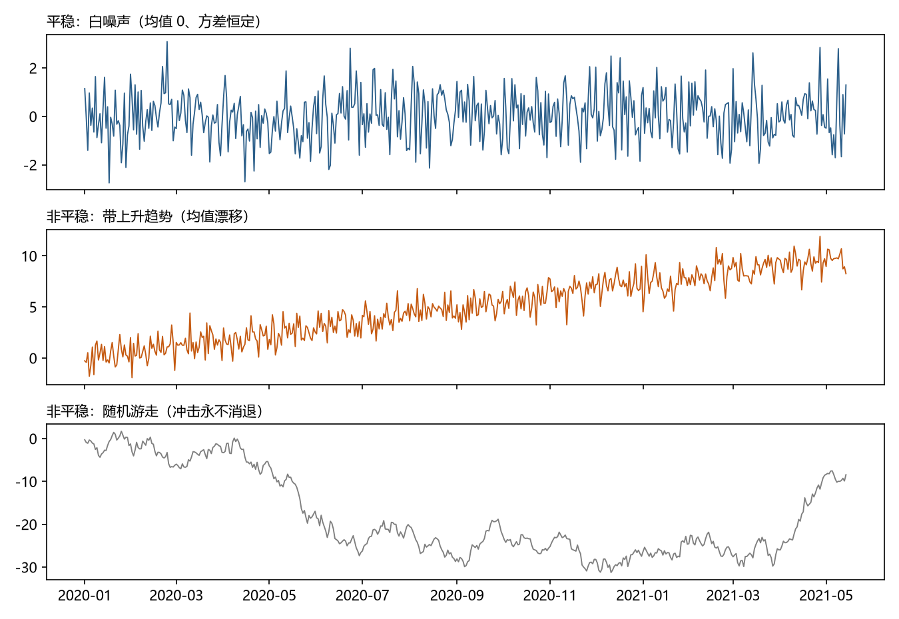
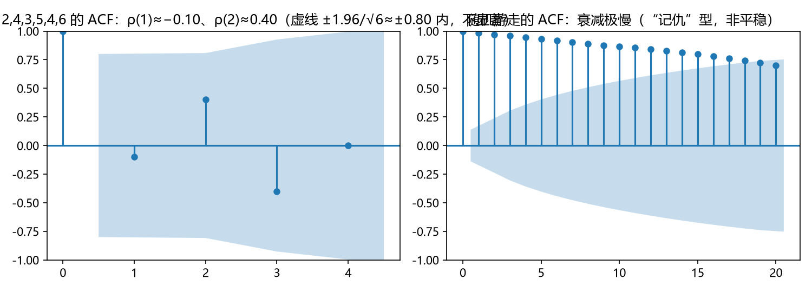

# 第 4 章 · 平稳性与白噪声：模型的基石

**本章目标**：学完本章后，你能①说出弱平稳的三个条件；②手算自相关函数 ACF 并读懂 ACF 图；③解释"非平稳导致伪回归"的机制；④面对非平稳序列知道该往哪个方向处理。

---

## 4.1 动机：为什么"规则不变"这么重要

设想两件事：

- **场景 A**：一台机器每天产出误差的均值一直是 0、波动一直是 ±1——规则十年不变。
- **场景 B**：今年误差均值 0，明年均值突然变 10，后年波动从 ±1 变成 ±100——规则年年变。

问题：**你能否用过去一年的数据预测明年的误差？** 场景 A 可以（历史有信息）；场景 B 基本不行（历史信息过期了）。

> 平稳性（stationarity）就是"规则不变"的数学化。**几乎所有经典推断都以它为前提**：如果规则一直在变，你凭什么相信"历史能告诉我们未来"？时间序列分析的第一件大事，就是判断"规则变不变"。

---

## 4.2 是什么：两个定义、一条曲线

### 4.2.1 平稳性的两种定义

- **严格平稳**：整个序列的"概率规律"任何时候都一样——任何一段数据的分布和另一段完全一致（这里"分布"指整段数据从头到尾的所有联合概率规律，比均值方差严格得多；你只需知道它"太苛刻、现实中基本用不上"即可）。这个条件太强，现实中几乎不满足，也很少用。
- **弱平稳（weak stationarity，协方差平稳）**：只要求三个条件（这是本书用的"平稳"）：
  1. **均值恒定**：`E[X_t] = μ`，不随时间 t 变；
  2. **方差恒定**：`Var[X_t] = σ²`，不随时间 t 变；
  3. **协方差只依赖时间间隔**：`Cov(X_t, X_{t+k}) = γ(k)` 只和间隔 k 有关，和起点 t 无关。

  第 3 点用大白话说：**"第 1 天与第 4 天"的关系，和"第 100 天与第 103 天"的关系，应当一样强**（两对都相隔 3 天，只是起点不同）——相关结构不因时间平移而改变。

为什么只要求"一阶矩和二阶矩"（均值、方差、协方差）？因为**实用**：这些是最容易估计、最常用的描述；够用就好，不追求完美。

### 4.2.2 白噪声是最简单的平稳过程

回顾第 3 章：白噪声 ε_t 是 i.i.d.、均值 0、方差 σ²。检查弱平稳三条件：均值恒定（0）✔；方差恒定（σ²）✔；前后无关所以协方差 0（当然只依赖间隔）✔。**白噪声是"最老实"的平稳过程**——所有平稳过程的检验基准。

### 4.2.3 自相关函数 ACF：平稳性的"体检报告"

**自相关（autocorrelation）**：序列和它自己滞后 k 步的相关系数，记 ρ(k)。

```
ρ(k) = Cov(X_t, X_{t+k}) / Var(X_t) = γ(k) / γ(0)
```

- ρ(0) = 1（自己和自己的相关当然最高）。
- ρ(k) 越大（接近 1）：滞后 k 的两点关系越强，"记忆"越长。
- 白噪声：ρ(k) = 0（k ≥ 1）——**没有记忆**。

**ACF 图**：横轴滞后 k（1, 2, 3, …），纵轴 ρ(k)，画成竖线图。它是时间序列最常用的"体检报告"——**一眼看出序列有多"记仇"**。

### 4.2.4 非平稳的三种常见形式

| 形式 | 违反哪个条件 | 例子 |
|---|---|---|
| **均值漂移（趋势）** | 均值恒定 | 逐年上升的销售额 |
| **方差漂移（波动聚集）** | 方差恒定 | 股市"平静期→剧烈期→平静期" |
| **季节性** | 协方差依赖起点 | 每年 12 月高、1 月低——1 月和 2 月的关系 ≠ 12 月和 1 月的关系 |

---

## 4.3 伪回归：为什么非平稳会"骗人"（必读）

这是本章最重要的一节，也是整个学科的起源故事之一。

**现象**：两个**毫无关系**的序列，只要都有上升趋势（比如"中国 GDP"和"美国某地降雨量"——趋势都是升的），算相关系数可能高达 0.9+，回归 R² 高得惊人。你几乎要相信"降雨导致 GDP 增长"了——**这是假的**。

**机制**（三步）：
1. 序列 A 有上升趋势 → 早年值小、晚年值大；
2. 序列 B 也有上升趋势 → 同样早年小、晚年大；
3. 于是"同年份"的 A 和 B 都偏小（早年）或都偏大（晚年）——把 (A, B) 按年份画散点：早年两点都小、聚在左下角，晚年都大、聚在右上角，一条从左下到右上的斜线就是高正相关。**这个高相关完全来自共同的时间趋势，而不是真的因果关系**（也正因如此，这不是"恰好"——只要两序列都单调上升，这几乎是必然）。

这正是 Yule 1926 年发现的"nonsense correlation"的正式版。统计学家后来证明：**两个独立的非平稳序列做回归，t 检验会"错误地"疯狂拒绝"无关系"**——即**伪回归（spurious regression）**（t 检验是检验回归斜率为 0 的标准工具，与相关系数本质是同一信息；这里的要害是"错误地"三个字）。模型"以为"发现了关系，其实只是两个时钟在同步走。

**如何躲开**：先检验平稳性；非平稳就先差分/去趋势（第 8 章），或用协整（第 11 章）。**记住：平稳性是"相关分析"的前提，就像"地基"是"盖楼"的前提。**

---

## 4.4 怎么做：判断平稳性的五步流程

### 第 1 步 · 画图 + 滚动统计量
- **做什么**：画时序图；再画"滑动窗口均值"和"滑动窗口方差"两条线（比如每 12 个月一个窗口）。
- **为什么**：如果均值线明显上升/下降 → 均值不恒定；如果方差线明显张开/收拢 → 方差不恒定。
- **会怎样**：得到初步判断："有趋势""有波动聚集"或"看起来平稳"。



*图 4.1 三种序列对比：白噪声（平稳）、带趋势序列（均值漂移）、随机游走（冲击永不消退）——后两者都是非平稳。*

### 第 2 步 · 手算或让软件算 ACF
- **做什么**：对序列计算 ρ(1), ρ(2), ρ(3), … 并画 ACF 图。
- **为什么**：平稳序列的 ACF 会**快速衰减**（隔几步就跌到 0 附近）；非平稳（尤其有趋势）序列的 ACF **衰减极慢**（隔很远还是接近 1）。
- **会怎样**：ACF 的"衰减速度"是判断平稳的最直观信号。

### 第 3 步 · 与"随机界限"对比
- **做什么**：ACF 图上通常画两条虚线（±1.96/√T，T 是样本长度；1.96 是正态分布 95% 分位点，统计惯例，现阶段无需深究）。落在虚线内的 ρ(k) 视为"统计上不显著"，可当作 0。
- **为什么**：样本 ACF 本身有抽样误差，短序列的 ρ(1)=0.4 可能只是运气。虚线是"多大才算真的相关"的标尺。
- **会怎样**：避免把噪声当信号——比如 4.5 示例里 ρ(2)=0.40，若 T 很小，这个 0.40 可能落在虚线内，就不足为信。

### 第 4 步 · 正式检验（ADF / KPSS）
- **做什么**：跑单位根检验（Augmented Dickey-Fuller，ADF）与 KPSS 检验。你现阶段只需要知道它们的分工：
  - **ADF**：原假设是"非平稳"（有单位根；"单位根"≈随机游走型的非平稳——过去的冲击永远不消退，术语来自数学特征方程，你只需记住：有单位根＝非平稳），p 值小 → 拒绝 → 判定平稳；
  - **KPSS**：原假设是"平稳"，p 值小 → 拒绝 → 判定非平稳。
- **为什么**：图形判断有主观性，检验给出可复现的结论；两个检验一起用，交叉印证（一个说"非平稳"另一个说"平稳"时，通常取保守判断）。
- **会怎样**：得到一个可写进报告的结论："ADF p=0.001，拒绝非平稳；KPSS p=0.2，不能拒绝平稳 → 判定序列平稳。"（具体公式与临界值留给工具软件，本书重点在解读结果。）

### 第 5 步 · 非平稳？三条出路
- **做什么**：根据非平稳的"形式"选择：
  - 均值漂移 → **差分**（用相邻差值替代原值）或去趋势；
  - 季节性 → **季节差分**或季节分解（第 2、8 章）；
  - 方差漂移 → 对数变换或 Box-Cox 变换（一族幂变换，含对数，把"乘法型"序列变"加法型"），或用**GARCH**（第 10 章）专门建模波动。
- **为什么**：把非平稳"处理成"平稳，经典推断（估计、检验、预测区间）才成立。
- **会怎样**：得到一条可建模的平稳序列；代价是**解释对象变了**（差分后建模的是"变化量"而不是"水平值"，第 8 章细说）。

---

## 4.5 完整示例：手算 ACF，看"记仇"程度

序列（6 个点，均值正好 4）：`2, 4, 3, 5, 4, 6`（手算时统一除以 n=6 的简化公式，只为方便；统计软件用另一版本，不影响对 ACF 形态的理解）

```
γ(0) = ((2−4)²+(4−4)²+(3−4)²+(5−4)²+(4−4)²+(6−4)²)/6 = (4+0+1+1+0+4)/6 ≈ 1.667
γ(1) = ((2−4)(4−4)+(4−4)(3−4)+(3−4)(5−4)+(5−4)(4−4)+(4−4)(6−4))/6
     = (0+0−1+0+0)/6 ≈ −0.167   →  ρ(1) = −0.167/1.667 ≈ −0.10
γ(2) = ((2−4)(3−4)+(4−4)(5−4)+(3−4)(4−4)+(5−4)(6−4))/6
     = (2+0+0+2)/6 ≈ 0.667      →  ρ(2) = 0.667/1.667 ≈ 0.40
```

**解读**：ρ(1)≈−0.10 很小（相邻关系弱），ρ(2)≈0.40 偏大——但只有 6 个点，虚线 ±1.96/√6≈±0.80，两个值都在线内，**不能断言有真实相关**。短样本的 ACF 不可靠，这正是"样本太少别下结论"的实证。



*图 4.2 左：4.5 节手算的平稳短序列，ACF 很快跌入虚线内（不显著）；右：随机游走，ACF 衰减极慢——"记仇"型非平稳的典型长相。*

**对比**：如果换成**带趋势或随机游走型**的序列（随机游走：每一步在上一步基础上加一个随机步长，步长可正可负、均值为 0——如 1, 2, 1.5, 3, 2.5, 4 这种"漂移不定"的长相），它的 ACF 会**很大且衰减极慢**（长样本下 ρ(1)、ρ(2)… 都接近 1）——"记仇"型，非平稳的典型长相。两者放一起看，ACF 的"衰减速度"一目了然。

---

## 4.6 这个环节可能遇到的问题（陷阱清单）

1. **把样本 ACF 的随机波动当真**：短序列 ρ(2)=0.40 可能只是噪声。**永远对照虚线（±1.96/√T）看显著性**。
2. **图形与检验矛盾时盲目选一边**：图看着平稳、ADF 却说非平稳——常见原因是**结构性断点**（均值突然跳变：画图能看到明显的阶梯，但它会让 ADF/KPSS 的结论失真）。两条规则：检验优先；两个检验结论不同时取保守；怀疑断点时用专门工具（见陷阱 7）。
3. **过度差分**：差分一次不够就差分十次，把平稳序列差成"无信号的白噪声"，丢失所有信息。**能少差就少差，差到平稳即可**（第 8 章有检验顺序）。
4. **只看均值不管方差**：方差漂移（波动聚集）在均值图上完全看不出，却会毁掉一切依赖"方差恒定"的推断。**检查方差必须用滚动方差图或专门检验**。
5. **把"季节"当"非平稳"一刀切处理**：季节性在严格意义上是非平稳（协方差依赖起点），但它是**可预测的规律**，处理方式与趋势型不同——直接差分可能引入更复杂的依赖（第 8 章用 SARIMA 处理）。**先分清"趋势型非平稳"和"季节型非平稳"。**
6. **伪回归的诱惑**：两个有趋势的序列相关极高，就想写"因果论文"。**先平稳化，再谈相关；真想谈因果，走第 11 章协整/格兰杰。**
7. **忽视结构断点（与陷阱 2 呼应）**：平稳性检验默认"规则要么一直不变、要么一直变"，但现实常有**突变**（政策、疫情）——断点既会让 ADF/KPSS 结论失真（陷阱 2），也需要专门建模工具（第 12 章马尔可夫机制转换）。

---

## 4.7 相似问题与已有解决方案：历史回响

| 本环节的困难 | 谁遇到过 | 如何解决 | 本书对应 |
|---|---|---|---|
| "两个趋势序列假装相关" | Yule 1926；Granger & Newbold 1974 证明伪回归 | **先平稳化再分析**；协整理论（Engle & Granger 1987）在"长期均衡"层面挽救非平稳关系 | 第 11 章 |
| "方差会变（波动聚集）" | 金融计量（Engle 1982） | **ARCH/GARCH**：把方差本身建模成随时间变化的量 | 第 10 章 |
| "规则突然切换（断点）" | 宏观计量（Hamilton 1989） | **马尔可夫机制转换**：让模型在不同状态间跳转 | 第 12 章 |
| "季节周期多长不知道" | 气象/信号处理 | **谱分析**：把周期变成频率上的尖峰，直接读出来（谱分析负责*发现*周期，SARIMA 负责*建模*——先诊断后处理） | 第 5、8 章 |
| "检验结论不稳" | 统计推断（Dickey & Fuller 1979） | 用**单位根检验**（ADF/KPSS）给出可复现判决；多检验交叉验证（第 4 章先用结论，第 19 章给出公式、临界值与推导） | 第 19 章 |

**核心启示**：非平稳不是"数据坏了"，而是"数据有不同的说话方式"——趋势、波动聚集、断点各有各的解法。**判断"是哪一种非平稳"比"是否非平稳"更重要。**

---

## 4.8 本章小结

1. **弱平稳**三条件：均值恒定、方差恒定、协方差只依赖间隔；白噪声是最简单的平稳过程。
2. **ACF**（ρ(k)=γ(k)/γ(0)）是平稳性的体检报告：平稳 → 快衰减；非平稳 → 慢衰减。
3. **伪回归**：两个独立但有趋势的序列会"假装"高度相关——先平稳化才能谈相关。
4. 判断流程：**滚动统计量 → ACF 图 → 显著性虚线 → ADF/KPSS 检验**；非平稳按形式选出路（差分/季节差分/变换/GARCH）。
5. 最大的坑：**把噪声当相关、把趋势当真相关、把季节性当趋势**。

下一章换一副"眼镜"看序列：从**频域**——同一串数据，在"时间"里看是波浪，在"频率"里看是几个尖峰。第 5 章 · 自相关与频域：两种看序列的方式。

---

## 4.9 练习与自测

1. ★ 弱平稳的三个条件是什么？白噪声满足吗？（提示：4.2.1/4.2.2）
2. ★ 为什么说"两个有上升趋势的无关序列，相关系数会虚高"？（提示：4.3 三步机制）
3. ★★ 用 4.5 节方法手算序列 `3, 1, 4, 2` 的 ρ(1)（提示：先求均值 γ(0)，再求 γ(1)）
4. ★★ ACF 图上 ρ(1)=0.85、ρ(2)=0.78、ρ(3)=0.70……一直衰减到 ρ(20) 还是 0.5。这个序列平稳吗？为什么？（提示：4.4 第 2 步）
5. ★★★ 用 statsmodels 对任意一个真实日度序列（如股票收盘价）跑 ADF 和 KPSS，解释两个 p 值的含义与结论。（提示：4.4 第 4 步；股票价格通常非平稳、收益率平稳）

**简答提示**：1 均值恒定、方差恒定、协方差只依赖间隔；白噪声满足（均值 0、方差 σ²、协方差 0）；2 同一时间段内两个序列都"同时偏小或偏大"，相关来自共同的时间位置而非因果关系；3 均值=2.5，γ(0)=(0.25+2.25+2.25+0.25)/4=1.25，γ(1)=((0.5)(−1.5)+(−1.5)(1.5)+(1.5)(−0.5))/4=(−0.75−2.25−0.75)/4=−0.9375，ρ(1)=−0.75；4 不平稳——ACF 衰减太慢是趋势型非平稳的典型特征；5 股价 ADF 的 p 通常很大（不能拒绝非平稳），收益率 ADF 的 p 很小（平稳）。

---

## 4.10 本章审阅记录

| 审阅项 | 结论 | 问题与修订 |
|---|---|---|
| R1 零基础可理解性 | ✔ 通过（修订后） | 子代理指出 5 处术语未解释（单位根、Box-Cox、1.96 出处、严格平稳的"分布"、分母除以 n 的惯例），已全部补白话注脚 |
| R2 为何行动 | ✔ 通过 | 伪回归三步机制补散点图视角（"为什么偏小/偏大=高相关"）；相关系数与 t 检验关系补桥接句 |
| R3 效果明确 | ✔ 通过 | 五步流程每步"会怎样"齐备；标题由"四步"改"五步"消除矛盾 |
| R4 陷阱覆盖 | ✔ 通过 | 陷阱 2/7 重复矛盾已合并（断点使检验失真 + 需专门工具）；陷阱 5 补"季节性严格意义非平稳但可预测" |
| R5 相似问题映射 | ✔ 通过 | ADF 行补"第 4 章先用结论、第 19 章给推导"；谱分析行补"发现 vs 建模分工" |
| R6 示例可复现 | ✔ 通过 | 修复硬错误：随机游走示例数字与实际手算相反，改为定性描述+补随机游走定义；4.5 全部数字子代理验算通过；练习 3 排版空格修复 |
| R7 章节衔接 | ✔ 通过 | 4.2.1 起点无关例子改为"第 1 天/第 4 天 vs 第 100 天/第 103 天"；结尾预告第 5 章频域 |
| R8 练习有效 | ✔ 通过 | 练习 3 答案 ρ(1)=−0.75 验算可复现；提示与正文一致 |

**审阅方式**：作者自查 + 独立"模拟零基础读者"子代理通读（反馈 15 条：硬错误 1、结构矛盾 4、术语 5、衔接 3、排版 2），全部处理并验算数字。
