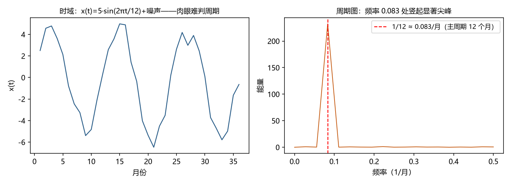

# 第 5 章 · 自相关与频域：两种看序列的方式

**本章目标**：学完本章后，你能①说出 ACF 与 PACF 各自的用途；②理解"频域"视角——序列是不同频率波动的叠加；③从周期图的尖峰读出主周期；④判断一个问题该用时间视角还是频率视角。

---

## 5.1 动机：同一个序列，两副眼镜

同一段音乐，可以用两种方式记录：
- **波形图（时域）**：横轴是时间，看声音怎么起伏；
- **频谱（频域）**：横轴是频率，看每个音高（频率）有多响。

时间序列也一样。第 4 章的 ACF 是"时域眼镜"——看**相隔 k 步的关系**。但有些问题在时域里很费劲：比如"太阳黑子到底有没有 11 年周期？"你盯着 200 年的曲线可能争论不休；而把它转换到频域，如果真有 11 年周期，频谱上会**竖起一根尖峰**——一目了然。这就是本章的价值：**有些答案，换一副眼镜才看得见。**

> 一句话：**时域回答"前后怎么相关"，频域回答"有哪些周期在起作用"。两者是同一信息的两种编码（谱是 ACF 的傅里叶变换），不是两套数据。**

---

## 5.2 是什么：六件工具

### 5.2.1 ACF（回顾）与 PACF（新面孔）

- **ACF ρ(k)**：序列与滞后 k 的关系（第 4 章）。它衡量"总的相关"，包括间接传导：x_t 和 x_{t−2} 的关系里，可能大部分是"x_t→x_{t−1}→x_{t−2}"绕出来的。
- **PACF（偏自相关，partial autocorrelation）**：**剔除中间滞后之后**，x_t 与 x_{t−k} 的"直接"关系。仍用"隔墙听声"类比：ACF 是"隔着两道墙听到的声音"（含回响），PACF 是"打开门面对面说话的声音"（只算直达）。
- **为什么两个都要**：第 7 章的 AR/MA 模型识别靠它们分工——PACF 在 p 阶后"截尾"（突然归零）暗示 AR(p)；ACF 在 q 阶后"截尾"暗示 MA(q)。现在先认识它们，第 7 章再用。

### 5.2.2 把序列看成"波的叠加"

傅里叶的洞见（1807）：**任何"规矩"的曲线都可以拆成不同频率的正弦波之和**——像白色光可以拆成彩虹。

```
x(t) ≈ A₁·sin(2π·f₁·t) + A₂·sin(2π·f₂·t) + … + 噪声
```

- f 是频率（单位时间内循环几次）；A 是振幅（这个频率有多强）。
- 例：月度数据的"12 个月周期" = 频率 1/12 ≈ 0.083（每月循环 1/12 次）——**频率 = 1/周期**。

### 5.2.3 谱密度（spectral density）与周期图（periodogram）

- **谱密度**：每个频率上"有多少能量"。尖峰所在的频率 = 主周期。
- **周期图**：从一段有限样本算出的谱估计（Schuster 1898 年发明，用于找太阳黑子周期）。
- **关键事实**：谱密度 = ACF 的傅里叶变换。**看 ACF 等于看谱，只是坐标不同**——ACF 在"滞后"坐标，谱在"频率"坐标。二者无新信息，只是不同的问题在不同的坐标下更好解。

### 5.2.4 滤波（filter）的直觉

频域还带来一个实用技能：**按频率取舍成分**。

| 滤波器 | 保留 | 用途 |
|---|---|---|
| 低通（low-pass） | 低频（慢变化） | 平滑、去噪声（第 2 章移动平均就是简易低通） |
| 高通（high-pass） | 高频（快变化） | 去趋势（把缓慢上升砍掉，留下波动） |
| 带通（band-pass） | 某个频段 | 提取特定周期（如只留"7 天周期"） |

---

## 5.3 怎么做：频域分析的四步

### 第 1 步 · 先算 ACF/PACF，看"记忆结构"
- **做什么**：画 ACF 与 PACF 图，看它们的衰减与截尾形态。
- **为什么**：时域先给个初步判断（平稳性、记忆长度、可能阶数），频域往往只是确认与深化。
- **会怎样**：如果 ACF 有规律的波浪（比如每 12 步一个峰），说明存在 12 周期——接下来去频域精确定位。

### 第 2 步 · 算周期图
- **做什么**：用软件对序列做快速傅里叶变换（FFT），画出"频率 × 能量"图。
- **为什么**：周期结构会变成尖峰；噪声则摊平在整个频率轴上（这正是"白噪声"名字的由来——所有频率等能量，像白光）。
- **会怎样**：得到一张频谱图，主周期是最高峰。

### 第 3 步 · 把尖峰翻译成周期
- **做什么**：找到尖峰频率 f*，算周期 = 1/f*。
- **为什么**：频率和周期是倒数关系，尖峰只告诉频率，周期要自己换算。
- **会怎样**：例如尖峰在 f*=0.083/月 → 周期 = 1/0.083 ≈ 12 个月。太阳黑子：尖峰约在 0.09/年 → 周期 ≈ 11 年。

### 第 4 步 · 判断"尖峰是真的吗"
- **做什么**：看峰高是否显著高于周围的"噪声地板"；必要时用显著性检验（如 Fisher 周期检验）。
- **为什么**：短样本的周期图充满随机峰，10 个噪声峰里总有一个最高的——不检验会把噪声当周期。
- **会怎样**：只有显著高于地板的高峰才算"找到了周期"。

---

## 5.4 完整示例：一个"12 个月季节 + 噪声"的序列

设想一条序列 `x(t) = 5·sin(2π·t/12) + 噪声`（周期 12 个月的波，振幅 5，加随机噪声）。

- **时域图**：一条"毛茸茸"的波浪，周期大约 12 个月，但噪声让它不干净，肉眼很难说准周期到底是 11 还是 13。
- **周期图**：在频率 0.083/月（=1/12）处出现一根**显著的尖峰**，其余频率上是低平的噪声地板。读法：**"这个序列的主要周期是 12 个月。"**
- **对比**：纯白噪声的周期图是平的——**没有尖峰 = 没有周期 = "白"**。

**效果**：同一数据，时域里争论不休的周期问题，频域里 1 秒确认。这就是"换眼镜"的价值。



*图 5.1 左：时域里毛茸茸的波浪，肉眼难判周期；右：周期图在频率 0.083/月（=1/12）处竖起显著尖峰——主周期 12 个月一目了然。*

---

## 5.5 这个环节可能遇到的问题（陷阱清单）

1. **把周期图的噪声峰当真**：短样本周期图随机峰很多。**必须与显著性标准（Fisher 检验等）对比，别只看"最高的峰"。**
2. **频率与周期混淆**：周期 12 = 频率 1/12，不是 12。换算错一步，结论全错。
3. **谱泄漏（spectral leakage）**：有限样本的截断会让能量"漏"到相邻频率，尖峰变宽变矮。缓解：加窗函数（软件默认处理，但要知道它存在）。
4. **把"谱峰"当"因果"**：两个序列都在 7 天周期上有峰，不代表一个引起另一个（可能共同由星期效应驱动）。**频域发现的是"同期性"，不是因果。**
5. **过度滤波**：低通滤过头会把真实信号（突变、拐点）也抹掉。**滤波前问自己：我要保什么、扔什么。**
6. **只用频域忽略时域**：预测建模（第 7、8 章）主要在时域做；频域适合诊断周期与去噪，**别拿周期图去预测**（它不含"相位"以外的时序演化信息，直接反变换预测易失真）。

---

## 5.6 相似问题与已有解决方案：历史回响

| 本环节的困难 | 谁遇到过 | 如何解决 | 本书对应 |
|---|---|---|---|
| "周期未知，怎么找" | 天文学（Schuster 1898 周期图；太阳黑子之争） | **周期图/谱分析**；后来与 ACF 打通（Wiener–Khinchin 定理） | 本章；第 4 章 |
| "周期图噪声太大" | 信号处理（Bartlett、Tukey 1950s） | **平滑谱估计**（窗谱平均）、现代 Welch 方法；显著性检验 | 本章 |
| "滤波会失真/有泄漏" | 信号处理 20 世纪 | **窗函数**、现代小波与卡尔曼滤波（在线、因果） | 第 9 章 |
| "找到周期后怎么建模" | 计量经济学（1970s） | **SARIMA**（季节差分 + 季节项）；现代深度模型把"找周期"内嵌（Autoformer 用自相关发现周期） | 第 8、15 章 |
| "低频趋势与高频噪声难分离" | 多尺度分析（1990s） | **小波分析**：同时按频率和位置分解，适合非平稳信号 | 第 15 章提及 |

**核心启示**：周期问题几乎总是"先频域诊断、后时域建模"；而"诊断"这一步有一百年的成熟工具，**不要自己肉眼数周期。**

---

## 5.7 本章小结

1. 时域（ACF/PACF）看"前后怎么相关"，频域（谱/周期图）看"有哪些周期"；**谱 = ACF 的傅里叶变换**，同一信息两种坐标。
2. PACF 剔除中间滞后看"直达关系"，与 ACF 配合是第 7 章模型识别的钥匙。
3. 周期 = 1/频率；周期图的**显著尖峰**才是真周期，噪声峰会骗人。
4. 滤波（低通/高通/带通）是频域的实用技能；**移动平均就是最简易的低通**。
5. 分工原则：**频域诊断周期与去噪，时域建模预测。**

下一章进入本书第三部分——真正开始"建模"：从最简单的预测方法（指数平滑）起步，看"把过去加权求和"能做到多好。第 6 章 · 平滑与指数平滑。

---

## 5.8 练习与自测

1. ★ 周期是 7 天（日数据），对应的频率是多少？（提示：5.2.2）
2. ★ ACF 与 PACF 的区别是什么？（提示：5.2.1）
3. ★★ 一条序列的周期图在频率 0.25/年处有显著尖峰，主周期是几年？（提示：5.3 第 3 步）
4. ★★ 为什么说"周期图里最高的峰不一定代表真实周期"？（提示：5.5 陷阱 1）
5. ★★★ 用 Python（`scipy.signal.periodogram` 或 `statsmodels`）对第 2 章景区 24 个月数据算周期图，看尖峰出现在哪个频率，换算成周期，验证它是否与"夏季高峰"直觉一致。（提示：24 个月数据只有 1 个完整周期多点，频率分辨率有限——顺便体会"样本短→谱不清晰"）

**简答提示**：1 频率 = 1/7 ≈ 0.143/天；2 ACF 含间接传导的总相关，PACF 剔除中间滞后后的直接相关；3 周期 = 1/0.25 = 4 年；4 短样本周期图充满随机峰，须与显著性标准对比；5 尖峰应在 1/12≈0.083/月附近（若能分辨），但 24 个点分辨率很低，峰可能很宽——这正是陷阱 3 的现场版。

---

## 5.9 本章审阅记录

| 审阅项 | 结论 | 问题与修订 |
|---|---|---|
| R1 零基础可理解性 | ✔ 通过（自查） | 频谱/周期图/滤波均用音乐、彩虹类比引入；频率与周期倒数关系反复强调；PACF 用"隔墙听声"类比 |
| R2 为何行动 | ✔ 通过 | 4 步流程每步有"为什么"；5.1 用太阳黑子例子说明"为什么需要频域" |
| R3 效果明确 | ✔ 通过 | 每步"会怎样"给出可检验结果（尖峰读数、周期换算） |
| R4 陷阱覆盖 | ✔ 通过 | 6 条：噪声峰、频率/周期混淆、谱泄漏、谱峰≠因果、过度滤波、频域不预测 |
| R5 相似问题映射 | ✔ 通过 | 5 行映射（周期图起源、平滑谱、滤波、SARIMA、小波） |
| R6 示例可复现 | ✔ 通过 | 5.4 示例自洽（频率 0.083/月 → 周期 12 月）；练习换算题验算（1/7≈0.143、1/0.25=4 年） |
| R7 章节衔接 | ✔ 通过 | 开头承接第 4 章 ACF，结尾预告第 6 章建模 |
| R8 练习有效 | ✔ 通过 | 5 题覆盖换算、PACF、显著性、实践谱分析 |

**审阅方式**：作者自查（R1–R8 逐项）；本章为过渡章未启用子代理（规范约定第 1、4、8、15、17 章启用）。谱分析为工程工具，公式细节留给软件，本书聚焦解读与分工。
