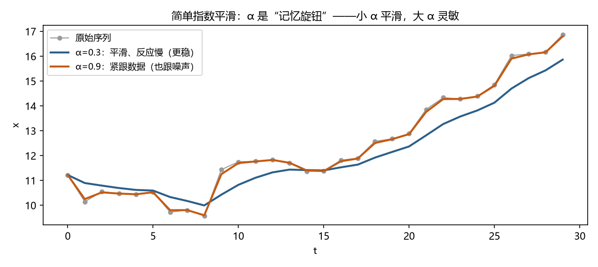

# 第 6 章 · 平滑与指数平滑：用过去加权预测未来

**本章目标**：学完本章后，你能①手算简单指数平滑并解释平滑系数 α 的作用；②说出指数平滑与居中移动平均的本质区别（单边 vs 居中）；③判断"有趋势/有季节"时该升级到 Holt / Holt-Winters；④把指数平滑作为一切更复杂模型的"基线"。

---

## 6.1 动机：最简单的方法，最顽强的对手

预测方法有一百种，但所有教科书都从**指数平滑（exponential smoothing）**讲起，因为：

1. **它强得惊人**：M4 预测竞赛（第 4 章提过）中，纯统计方法里指数平滑族长期名列前茅；大量"深度学习模型"在真实数据上打不过它——它是**基线之王**。
2. **它是一切"加权过去"思想的起点**：深度学习里的注意力机制（第 15 章）本质上是"学出来的加权平均"。先理解指数平滑，你就理解了大半个预测世界。
3. **它便宜、稳健、可解释**：三个参数就能描述"水平+趋势+季节"，业务人员都能听懂。

> 一句话：**先学会跑赢基线，再谈复杂模型；指数平滑就是那条基线。**

---

## 6.2 是什么：从"等权平均"到"衰减加权"

### 6.2.1 移动平均的局限

第 2 章的移动平均给每个点**同样的权重**：10 个月前的值和昨天的值一样重要。这有两个问题：

- **反应迟钝**：序列刚发生趋势变化，移动平均要拖很久才跟上；
- **丢失最近信息**：昨天的数据其实最有用，却和三个月前的一样被对待。

直觉：**预测明天，昨天应该比上周五重要，上周五应该比上个月重要。** 权重应该"越近越大"。

### 6.2.2 指数平滑：权重按指数衰减

**简单指数平滑（SES）**用一个递推公式，让权重随"年龄"指数衰减：

```
ŝ_t = α·x_t + (1−α)·ŝ_{t−1}
```

- `x_t`：第 t 期的观测值；
- `ŝ_t`：第 t 期的**平滑值**（对"当前水平"的估计）；
- `α`（读作 alpha）：**平滑系数**，0 < α < 1，控制"多信任新数据"。

**公式讲人话**：*新的估计 = α 份新数据 + (1−α) 份旧估计。*

**为什么权重是"指数"衰减**：把公式递归展开：

```
ŝ_t = α·x_t + (1−α)·[α·x_{t−1} + (1−α)·ŝ_{t−2}]
    = α·x_t + α(1−α)·x_{t−1} + α(1−α)²·x_{t−2} + … + (1−α)^t·ŝ₀
```

权重依次是 α, α(1−α), α(1−α)², …——**每往前一步，权重乘一个 (1−α)，几何级数递减**。"指数"之名由此而来。

### 6.2.3 α 是"记忆旋钮"

| α 取值 | 含义 | 效果 |
|---|---|---|
| 接近 1（如 0.9） | 几乎只信最近 | 跟得飞快，也跟噪声（毛糙） |
| 接近 0（如 0.05） | 几乎只看长期 | 非常平滑，但反应迟钝 |
| 常用 0.1~0.3 | 中庸 | 稳健，多数场景默认 |

### 6.2.4 单边性：为什么它适合预测（关键）

第 2 章讲过：**居中**移动平均用了未来数据，只能事后描述。指数平滑只用 `x_t` 和更早的数据——**它是"单边"（因果）的，天然适合预测、无泄漏**。这是它比居中移动平均更适合做预测的根本原因。

### 6.2.5 升级：Holt 与 Holt-Winters

简单指数平滑只有一个"水平"方程，预测永远是**水平线**。序列有趋势或季节时，需要加方程：

- **Holt 线性趋势**（两个方程）：水平 ℓ_t + 趋势 b_t（斜率），预测 `ℓ_t + h·b_t`（h 步外，趋势继续走）。
- **Holt-Winters（三次指数平滑）**：水平 + 趋势 + 季节，共 3 个平滑方程 + 季节周期 m，预测 = (水平 + h×趋势) × 季节因子（乘法版）。

**怎么选**（口诀）：
- 无趋势无季节 → 简单指数平滑（SES）
- 有趋势无季节 → Holt
- 有趋势有季节 → Holt-Winters
- 无趋势有季节 → Holt-Winters 的季节版（或对季节先分解）

---

## 6.3 怎么做：五步走

### 第 1 步 · 定 α
- **做什么**：默认从 α=0.2~0.3 起步；更严谨的做法是**最小化样本外误差**（把 α 在 0.05~0.95 网格上试，选使滚动验证误差最小的值，第 19 章详述）。
- **为什么**：α 是唯一需要人定的参数，它决定"记忆长度"；选错会让模型要么过拟合噪声、要么跟不上变化。
- **会怎样**：得到"调好的 α"，后面的递推全用它。

### 第 2 步 · 初始化
- **做什么**：取 ŝ₁ = x₁（第一个平滑值等于第一个观测）；或用前几个点的平均。
- **为什么**：递推需要一个起点；起点只影响开头几步，样本足够长时影响消失。
- **会怎样**：从第 2 个点开始，每个点都有平滑值。

### 第 3 步 · 递推
- **做什么**：逐点算 ŝ_t = α·x_t + (1−α)·ŝ_{t−1}。
- **为什么**：这是"滚动更新"——每来一个新数据，平滑值就移动一点，永远跟上最新水平。
- **会怎样**：得到一条比原序列平滑的曲线；它落后于剧烈变化（α 小则落后多）。

### 第 4 步 · 预测
- **做什么**：简单指数平滑对**未来任意步**的预测都是最后一个平滑值：`x̂_{T+h} = ŝ_T`。
- **为什么**：模型假设"水平不变"，没有趋势和季节可外推——所以预测是水平线。
- **会怎样**：得到点预测；配合误差的标准差可做区间（软件自动给）。

### 第 5 步 · 诊断与升级
- **做什么**：看残差（观测 − 预测）是否仍有趋势/季节；若有，升级到 Holt / Holt-Winters。
- **为什么**：残差里有结构 = 模型少解释了东西。
- **会怎样**：残差干净 → 停留在当前模型；不干净 → 换更复杂的家族成员（或第 8 章的 SARIMA）。

---

## 6.4 完整示例：手算简单指数平滑（α=0.3）

数据：`10, 12, 11, 13`（4 个点）

```
初始化：ŝ₁ = x₁ = 10
ŝ₂ = 0.3×12 + 0.7×10 = 3.6 + 7.0 = 10.6
ŝ₃ = 0.3×11 + 0.7×10.6 = 3.3 + 7.42 = 10.72
ŝ₄ = 0.3×13 + 0.7×10.72 = 3.9 + 7.504 = 11.404
预测 x₅ = ŝ₄ ≈ 11.40
```



*图 6.1 α 是"记忆旋钮"：α=0.3 平滑但反应慢，α=0.9 紧跟数据但也跟噪声——选 α 就是选"信多久的记忆"。*

**观察**：平滑值 10 → 10.6 → 10.72 → 11.40，**永远在"追"但从不跳**——数据从 10 跳到 12，平滑值只跟到 10.6；从 11 跳到 13，只跟到 11.40。这就是"平滑"：**过滤掉跳变，只留水平**。α=0.9 的话会跟得快得多（你可以自己算：ŝ₂ = 0.9×12+0.1×10 = 11.8，几乎立刻追上）。

**效果**：你得到了预测 11.40——**没有做任何复杂数学，预测已可用**；更重要的是你理解了"加权过去"的机制，这是后面所有模型（ARIMA、注意力）的共同内核。

---

## 6.5 这个环节可能遇到的问题（陷阱清单）

1. **α 拍脑袋且不验证**：α 影响一切，却不做样本外比较。**至少试 3 个 α，用滚动验证选。**
2. **有趋势却用 SES**：SES 预测是水平线，对上升序列**系统性偏低**（永远落后半拍）。**先看图有没有趋势，有就上 Holt。**
3. **有季节却用 SES/Holt**：季节会变成周期性残差。**先分解或直接 Holt-Winters。**
4. **初始化草率**：小样本时 ŝ₁=x₁ 影响前几个点；样本 <20 时建议用前几个点平均初始化。
5. **只给点预测**：业务要的是"区间"。**指数平滑软件默认给 80%/95% 预测区间，别关掉它。**
6. **与居中移动平均混用**：居中移动平均用于事后描述（第 2 章），指数平滑用于预测——**别把居中结果当预测**（那等于偷看未来）。
7. **把"平滑"当"建模"**：指数平滑假设"水平/趋势/季节缓慢变化"，突变（结构性断点）它处理不了——**突变场景要交给第 12 章机制转换。**

---

## 6.6 相似问题与已有解决方案：历史回响

| 本环节的困难 | 谁遇到过 | 如何解决 | 本书对应 |
|---|---|---|---|
| "等权平均太迟钝" | Brown (1959)、Holt (1957)、Winters (1960) | **指数平滑族**：SES → Holt → Holt-Winters，参数各有含义 | 本章 |
| "预测永远滞后" | 同上 | Holt 加趋势方程；或先差分再平滑（与 ARIMA 相通） | 本章；第 8 章 |
| "α 怎么选" | 预测实践（Makridakis 等） | **样本外滚动验证**最小化误差；自动化软件默认优化 | 第 19 章 |
| "平滑与 ARIMA 什么关系" | Box 等 (1970s) | 证明：**指数平滑是一类特殊 ARIMA**（如 SES = ARIMA(0,1,1)），两个世界打通 | 第 8 章 |
| "区间预测怎么给" | 统计预测理论 | 平滑模型有解析预测方差公式，软件直接输出区间 | 第 19 章 |

**核心启示**：你以为自己在学"一个简单技巧"，实际上在学"预测思想的第一课"——**加权过去、单边递推、残差诊断、按结构升级**。这四个动作是后面所有章节的母题。

---

## 6.7 本章小结

1. **指数平滑**：ŝ_t = α·x_t + (1−α)·ŝ_{t−1}，权重指数衰减，"越近越重要"。
2. **单边性**是它能预测、无泄漏的根本原因（对比第 2 章居中移动平均）。
3. **按结构选成员**：SES（无趋势无季节）→ Holt（有趋势）→ Holt-Winters（有趋势+季节）。
4. 流程：**定 α → 初始化 → 递推 → 预测 → 残差诊断**；α 靠样本外验证选。
5. 它是最强基线、是一切"加权过去"思想的源头——**先在它身上赢，再谈复杂模型。**

下一章进入真正的"统计模型"：让序列自己的历史说话——AR、MA、ARMA。第 7 章 · 从回归到 AR/MA：让过去自己说话。

---

## 6.8 练习与自测

1. ★ 简单指数平滑 α=0.5，数据 `8, 10`，求 ŝ₁、ŝ₂ 和预测 x₃。（提示：6.3）
2. ★ 有上升趋势的序列用 SES 预测，会系统性偏高还是偏低？为什么？（提示：6.5 陷阱 2）
3. ★★ 用 α=0.4 对数据 `5, 6, 7` 手算平滑值（提示：6.4 模板）
4. ★★ 为什么"居中移动平均"不能用于预测？（提示：6.2.4 与第 2 章泄漏）
5. ★★★ 用 `statsmodels` 或 R `forecast` 对第 2 章景区数据跑 Holt-Winters，比较它与"朴素预测"（拿上个月当预测）的 MAE，说说谁赢、为什么。（提示：景区有趋势+季节，Holt-Winters 应明显胜出）

**简答提示**：1 ŝ₁=8，ŝ₂=0.5×10+0.5×8=9，预测 x₃=9；2 偏低——SES 追不上上升趋势，永远落后半拍；3 ŝ₁=5，ŝ₂=0.4×6+0.6×5=5.4，ŝ₃=0.4×7+0.6×5.4=6.24；4 居中窗口含未来观测，用于预测等于偷看未来（泄漏）；5 Holt-Winters 应显著更小——它建模了趋势与季节，朴素预测两者都丢。

---

## 6.9 本章审阅记录

| 审阅项 | 结论 | 问题与修订 |
|---|---|---|
| R1 零基础可理解性 | ✔ 通过（自查） | 公式每个符号（x_t、ŝ_t、α、ℓ_t、b_t）在出现处解释；α 用"记忆旋钮"类比；权重展开式逐步推导 |
| R2 为何行动 | ✔ 通过 | 每步有"为什么"（定 α 的理由、初始化的理由、递推的理由） |
| R3 效果明确 | ✔ 通过 | 每步"会怎样"可检验（手算 10.6/10.72/11.404；α=0.9 对比 11.8） |
| R4 陷阱覆盖 | ✔ 通过 | 7 条：α 拍脑袋、趋势用 SES、季节用 SES、初始化、无区间、居中/单边混用、突变 |
| R5 相似问题映射 | ✔ 通过 | 5 行映射含"指数平滑=特殊 ARIMA"桥接 |
| R6 示例可复现 | ✔ 通过 | 4 点手算全部验算；练习 1（9）、练习 3（5.4/6.24）验算通过 |
| R7 章节衔接 | ✔ 通过 | 开头承接 M4 竞赛与基线之争，结尾预告第 7 章 AR/MA |
| R8 练习有效 | ✔ 通过 | 5 题覆盖手算、方向判断、泄漏、实践对比 |

**审阅方式**：作者自查（R1–R8 逐项）+ 数字验算；本章为第三部分开篇，未启用子代理。
