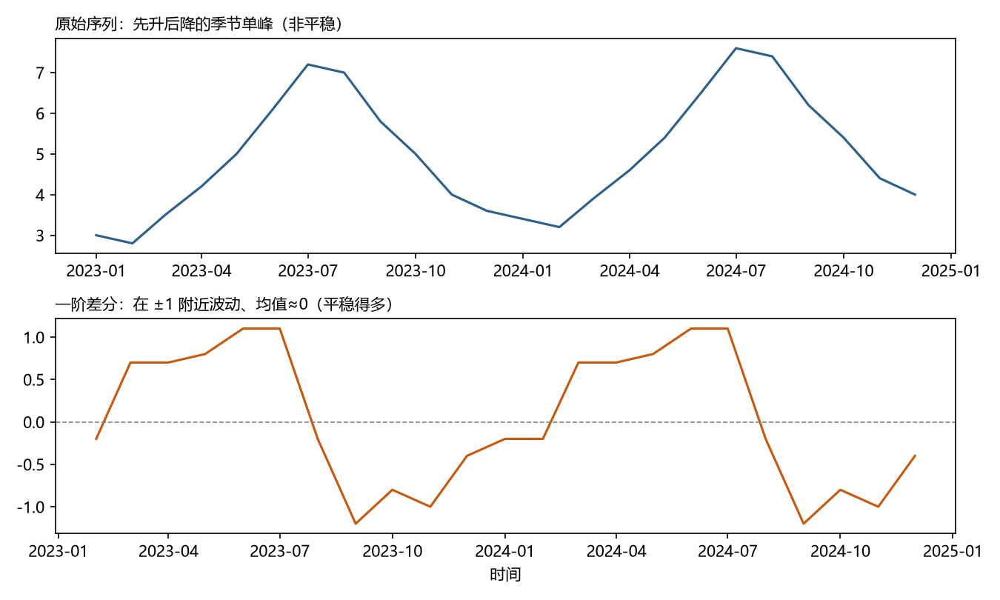

# 第 8 章 · ARIMA 与 Box-Jenkins：一套完整建模工作流

**本章目标**：学完本章后，你能①说出 ARIMA(p,d,q) 与 SARIMA 每个字母的含义；②手算一阶差分并解释"差分做了什么"；③按 Box-Jenkins 五步走完一个完整案例；④说出"差分次数怎么定"和"什么时候该用 SARIMA"。

---

## 8.1 动机：把"非平稳"也请进模型

第 7 章的 ARMA 有个苛刻前提：**序列必须平稳**。但第 4 章说过：真实数据几乎都不平稳——有趋势、有季节。难道把 ARMA 扔掉？

Box 和 Jenkins 1970 年的回答是：**不扔，改造**。办法简单得惊人——**先把非平稳"差掉"，再对剩下的平稳部分建 ARMA，预测完再把差分"加回去"**。这就是 ARIMA，它让"平稳"这个约束从"前提"变成了"流程的一步"。

> 一句话：**ARIMA = 差分（处理非平稳） + ARMA（建模平稳部分）。** 它把第 4 章的"非平稳怎么办"和第 7 章的"平稳怎么建"焊成了一条流水线。

这套方法之所以伟大，不只是模型本身，而是它提出的**建模纪律**——识别、估计、诊断、再修正的循环。五十年后，深度学习的调参循环本质上还是它。

---

## 8.2 是什么：差分与三个字母

### 8.2.1 差分（difference）：非平稳的"手术刀"

**一阶差分**：`x'_t = x_t − x_{t−1}`——用"相邻变化量"替代"水平值"。

**为什么能去趋势**（爬坡类比）：把序列想成一条斜坡，差分算的是"每一步的步高"。若斜坡是直的（每月固定涨 2），步高恒等于 2——**差完等于把坡抹平成平地**；若坡还带点噪声，步高就是 2±噪声，均值稳定在 2 而非 0（差分去掉的是"位置漂移"，留下的是"每步的平均涨幅"）。差完之后序列**均值不再漂移**，就平稳了。

**二阶差分**：对一阶差分再差一次——对付"上升速度本身还在变"（弯曲趋势）。日常很少超过二阶。

**季节差分**：`x_t − x_{t−m}`（m=季节周期，如 12）——专门去季节。**注意：季节差分 ≠ 普通差分**，普通差分会留下季节残渣（第 4 章陷阱 5 的现场版）。

### 8.2.2 ARIMA(p,d,q)：三个字母

| 字母 | 含义 | 对应第 7 章 |
|---|---|---|
| **p** | 自回归阶数 | AR 部分 |
| **d** | **差分次数** | 新成员 |
| **q** | 滑动平均阶数 | MA 部分 |

**ARIMA(1,1,1)** 读作：先差 1 次，再对差分序列建 ARMA(1,1)。

**完整流程**（含"还原"）：

```
原始 x_t →（差分 d 次）→ 平稳序列 y_t →（ARMA 建模）→ 预测 ŷ →（差分"加回"）→ 预测 x̂
```

**为什么"还原"能行**：差分是可逆操作——知道了 ŷ_{T+1} 和 x_T，就有 x̂_{T+1} = x_T + ŷ_{T+1}。预测的是"变化量"，还原后才是"水平"。多步预测要逐步累加：x̂_{T+2} = x̂_{T+1} + ŷ_{T+2}，x̂_{T+3} = x̂_{T+2} + ŷ_{T+3}，依此类推。

### 8.2.3 SARIMA：把季节请进来

**SARIMA(p,d,q)(P,D,Q)_m**：在 ARIMA 之外加一套"季节版"参数（大写 P、D、Q）与季节周期 m。逐项对照：

| 记号 | 含义 |
|---|---|
| p、d、q | 普通部分：AR 阶数、差分次数、MA 阶数（同 8.2.2） |
| P | 季节 AR 阶数（建模"去年同月"的自回归） |
| D | 季节差分次数（如 D=1 表示 x_t − x_{t−12}） |
| Q | 季节 MA 阶数 |
| m | 季节周期（月度数据 m=12，周数据 m=7） |

- 例如 `ARIMA(1,1,1)(1,1,1)₁₂`：普通部分 ARMA(1,1)、差分一次；季节部分 ARMA(1,1)、季节差分一次，月度数据。
- **直觉**：普通部分学"相邻依赖"（昨天影响今天），季节部分学"跨年依赖"（去年 12 月影响今年 12 月）。
- **什么时候用**：ACF 在季节滞后（12、24、36…）处还有明显的峰，且普通 ARIMA 残差仍呈周期——就去季节差分或加季节项。

### 8.2.4 一个美丽的桥

**指数平滑 = 特殊 ARIMA**：SES 等价于 ARIMA(0,1,1)，Holt 等价于 ARIMA(0,2,2)，Holt-Winters 等价于某些 SARIMA。1970s 被证明——**第 6 章的"加权机器"和第 7 章的"机制模型"原来是一家**。（为什么等价？两个模型都在做"一步记忆 + 新信息"的递推更新，数学形式同构；证明较繁琐，第 19 章给出指引，知道"它们是一家"就够用。）这条桥让你在"简单稳健"（指数平滑）和"灵活完整"（ARIMA）之间自由切换。

---

## 8.3 怎么做：Box-Jenkins 五步（完整案例）

用第 2 章景区数据**前 12 个月**（2023 年）演示，目标是预测 2024 年 1 月：

```
3.0, 2.8, 3.5, 4.2, 5.0, 6.1, 7.2, 7.0, 5.8, 5.0, 4.0, 3.6
```

### 第 1 步 · 识别：序列平稳吗？
- **做什么**：画图 + ADF 检验（第 4 章）。
- **为什么**：决定要不要差分、差几次。
- **会怎样**：形态是先升后降的**季节单峰**（1→7 月从 3.0 爬到 7.2，7→12 月回落到 3.6），ADF 的 p 值大 → **非平稳** → 需要差分。（ADF 的原假设是"序列非平稳"，p 值大＝不能拒绝原假设，即判定非平稳——与常见检验"p 小才有证据"相反，别记反。）

### 第 2 步 · 差分到平稳
- **做什么**：算一阶差分。记 `x'_t = x_t − x_{t−1}`，表示**第 t 月比第 t−1 月的变化量**，全部 11 个：
```
x'_2 = 2.8 − 3.0 = −0.2   x'_3 = 3.5 − 2.8 = +0.7
x'_4 = 4.2 − 3.5 = +0.7   x'_5 = 5.0 − 4.2 = +0.8
x'_6 = 6.1 − 5.0 = +1.1   x'_7 = 7.2 − 6.1 = +1.1
x'_8 = 7.0 − 7.2 = −0.2   x'_9 = 5.8 − 7.0 = −1.2
x'_10 = 5.0 − 5.8 = −0.8  x'_11 = 4.0 − 5.0 = −1.0
x'_12 = 3.6 − 4.0 = −0.4
```
- **为什么**：差分把"先升后降的摆动"拉平为"围绕某个值波动"（爬坡类比：差分算每一步的步高，差完等于把坡抹平）。
- **会怎样**：差分序列在 ±1 附近波动、均值≈0.05——比原始序列平稳得多。**再跑一次 ADF 确认平稳**；不平稳就再差一次（但别贪，见 8.5 陷阱 1）。**提醒：这数据明显有季节，严格说该用季节差分（见 8.5 陷阱 3），这里先用普通差分演示机制。**



*图 8.1 上图：原始序列（先升后降的季节单峰，非平稳）；下图：一阶差分（在 ±1 附近波动、均值≈0，平稳得多）——差分把"摆动"抹平为围绕 0 波动。*

### 第 3 步 · 识别 p、q
- **做什么**：看差分序列的 ACF/PACF，对照第 7 章识别表。
- **为什么**：确定 ARMA 的阶数。
- **会怎样**：12 个点太少，ACF/PACF 基本都在虚线内——此时**取小阶数**（如 ARIMA(0,1,1) 或 (1,1,0)），或者干脆承认"数据不够、改用指数平滑"。**短样本的诚实选择也是建模能力的一部分。**

### 第 4 步 · 估计与诊断
- **做什么**：软件拟合（自动给出系数与标准误）；检验残差白噪声（Ljung-Box）。
- **为什么**：残差不白 = 模型没挖干净。
- **会怎样**：残差 p 值大 → 合格；p 值小 → 加阶数或加季节项（见 8.2.3）重来。

### 第 5 步 · 预测并还原
- **做什么**：软件给出差分层面的预测 ŷ，再加回 x₁₂ 得水平预测：
```
x̂₁₃ = x₁₂ + ŷ₁₃ = 3.6 + ŷ₁₃
```
- **为什么**：还原是差分的逆操作，预测"变化量"再变回"水平"。
- **会怎样**：得到 2024 年 1 月的点预测与区间。**注意：数据只有 12 个月、还有季节没建模——这个预测会偏保守，正式分析要用多年数据 + SARIMA。**

---

## 8.4 完整示例：线性趋势序列的"完美差分"

数据：`3, 5, 7, 9`（完美的线性趋势：每月 +2）

```
一阶差分：5−3=2, 7−5=2, 9−7=2 → 2, 2, 2 （常数！）
```

**观察**：差分后是常数 2——没有趋势、没有波动，ARMA 部分只需一个均值 2。预测下一个差分 = 2，还原：x₅ = 9 + 2 = **11**。

**效果**：这个例子把 ARIMA 的思想照得透亮——**趋势是"常数的差分"，差掉之后剩下的就是"老实"的部分**。真实数据没有这么完美（差分后是 2±噪声），但机制完全一样。

---

## 8.5 这个环节可能遇到的问题（陷阱清单）

1. **过度差分**：差 5 次总比 1 次"更平稳"，但信号也差没了——预测变成"预测噪声"。**准则：差到刚好平稳就停（ADF/KPSS 循环确认）；差分次数一般 ≤2。**
2. **忘了"解释对象变了"**：差分的模型预测的是**变化量**，业务要的是水平——**还原步骤不能省**；向业务解释时也要说"我们预测的是变化"。
3. **季节数据用普通差分**：月度数据普通差分后，ACF 在 12、24 处仍有大峰——**需要季节差分或 SARIMA**。
4. **把 auto.arima 当黑箱**：自动选阶方便，但**不看残差诊断、不看业务合理性**，等于让软件替你放弃思考。**自动选阶 + 人工诊断**才是正确姿势。
5. **预测区间处理不当**：ARIMA 的 h 步（h＝向未来预测的步数）预测区间随 h **逐渐变宽**——因为模型的记忆有限，远期可用的过去信息趋近于零，预测收缩回长期均值、不确定性累积，所以区间越拉越宽。这是对的；但很多人只汇报点预测，把"会变宽"藏起来。
6. **忽略外生变量与断点**：有已知的节假日效应、政策冲击，ARIMA 学不会——**需要 ARIMAX/回归项，或第 12 章机制转换**。
7. **样本太短硬上 ARIMA**：ARIMA 对样本量有要求（一般建议 ≥30~50 个点）；短序列用指数平滑更稳。**模型的复杂度要和样本量匹配。**

---

## 8.6 相似问题与已有解决方案：历史回响

| 本环节的困难 | 谁遇到过 | 如何解决 | 本书对应 |
|---|---|---|---|
| "非平稳进不了模型" | Box & Jenkins (1970) | **差分 + ARIMA**：把平稳化变成流程一步 | 本章 |
| "季节怎么办" | Box & Jenkins (1970)；官方统计 X-11（季节调整程序） | **SARIMA**（季节差分 + 季节项） | 本章 |
| "差几次、阶数多少" | Akaike (1974)、Dickey & Fuller (1979) | **ADF 与 KPSS**（互补的平稳性检验）定 d；**AIC/BIC**（拟合优度+复杂度惩罚）定 p,q；auto.arima 自动化（Hyndman & Khandakar 2008） | 本章；第 19 章 |
| "残差不白怎么办" | Box & Jenkins | 加大阶数 / 加季节 / 加外生变量（ARIMAX＝带外生回归项的 ARIMA）→ 重走识别 | 本章 |
| "简单方法与 ARIMA 谁好" | Makridakis 竞赛系列（M-competitions 1982–2020） | **结论反复：短样本/简单序列，指数平滑常赢；复杂序列 ARIMA 或集成赢**——基线对比永不过时 | 第 6 章；第 19 章 |

**核心启示**：ARIMA 的每一步失败模式都有对治手段（差分→ADF；阶数→AIC；残差→Ljung-Box；季节→SARIMA；自动→auto.arima）——**"建模"就是"用工具诊断问题、按诊断改模型"的循环**。

---

## 8.7 本章小结

1. **ARIMA(p,d,q)** = 差分（d 次）处理非平稳 + ARMA(p,q) 建模平稳部分；预测完要**还原**。
2. **差分**把"缓慢上升"变成"围绕常数波动"；差分次数靠 ADF/KPSS 循环确认，**≤2 次，别贪**。
3. **SARIMA(p,d,q)(P,D,Q)_m** 加一套季节部分，对付"去年 12 月影响今年 12 月"。
4. **Box-Jenkins 五步**：①识别（平稳？）→ ②差分 → ③定阶（ACF/PACF、AIC）→ ④估计+诊断（残差白噪声，不白就回头）→ ⑤预测还原。
5. **指数平滑 = 特殊 ARIMA**——两个世界一座桥。

下一章换一条完全不同的技术路线：**状态空间模型与卡尔曼滤波**——不靠差分，而是假设"隐藏状态"在演化，从噪声观测中把它实时滤出来。第 9 章 · 状态空间与卡尔曼滤波。

---

## 8.8 练习与自测

1. ★ ARIMA(2,1,0) 各部分含义？（提示：8.2.2）
2. ★ 数据 `1, 4, 7, 10` 一阶差分后是什么？下一个水平预测若差分预测为 3，x₅ 是多少？（提示：8.4）
3. ★★ 月度数据普通差分后 ACF 在滞后 12、24 处还有大峰，说明什么？怎么办？（提示：8.5 陷阱 3）
4. ★★ 为什么 ARIMA 的预测区间会随预测步数变宽？（提示：8.5 陷阱 5 与 7.2.1 均值回归）
5. ★★★ 用 `pmdarima.auto_arima` 或 R `auto.arima` 对第 2 章景区 24 个月数据自动选阶，再手动检查：①自动选了什么 (p,d,q)(P,D,Q) 与 m；②残差 Ljung-Box 的 p 值（大＝合格）；③预测 2025 年 1 月并还原成水平值。评价自动结果是否合理——检查清单：是否处理了季节、p 值是否真的大、预测是否符合"2 月低谷"的业务直觉。（提示：8.5 陷阱 4——自动+人工）

**简答提示**：1 p=2（AR 部分 2 阶）、d=1（差 1 次）、q=0（无 MA 部分）；2 差分 `3,3,3`；x₅ = 10+3 = 13；3 季节残渣——需要季节差分或 SARIMA；4 远期冲击的不确定性累积，预测回到均值且区间变宽（统计上远期信息趋近于零）；5 评价要点：自动结果应含季节部分 (P,D,Q)（否则不合格）、Ljung-Box p 值应大于 0.05、2025 年 1 月预测应落在 3~4 万区间（2 月更低）。

---

## 8.9 本章审阅记录

| 审阅项 | 结论 | 问题与修订 |
|---|---|---|
| R1 零基础可理解性 | ✔ 通过（修订后） | SARIMA 记号逐项解释表；ARIMAX/X-11/KPSS 补括注；ADF"p 大→非平稳"补原假设说明 |
| R2 为何行动 | ✔ 通过 | 差分加"爬坡类比"（步高=抹平坡）；指数平滑=ARIMA 补同构直觉；预测区间变宽补机制 |
| R3 效果明确 | ✔ 通过 | 还原补多步累加；陷阱 5 补"远期收缩回均值"效果 |
| R4 陷阱覆盖 | ✔ 通过 | 8.5 七条保留；案例第 2 步预告"季节该用季节差分"消除教学定式 |
| R5 相似问题映射 | ✔ 通过 | 表内黑话补注，与正文呼应 |
| R6 示例可复现 | ✔ 通过 | 修复硬伤：8.3 把季节波形误标为"上升趋势"改为"先升后降季节单峰"；差分补全 11 个值并验证（x'_6=1.1、x'_7=1.1、x'_9=−1.2 等） |
| R7 章节衔接 | ✔ 通过 | 小结步数与"五步"标题统一；开头承接第 7 章，结尾预告第 9 章 |
| R8 练习有效 | ✔ 通过 | 练习 5 补数据出处与评价清单；"5 略"改为可核对的评价要点 |

**审阅方式**：作者自查 + 独立"模拟零基础读者"子代理通读（反馈 12 条：概念性错误 1、术语 4、衔接 3、数字 2、练习 2），全部处理并验证差分数字。
