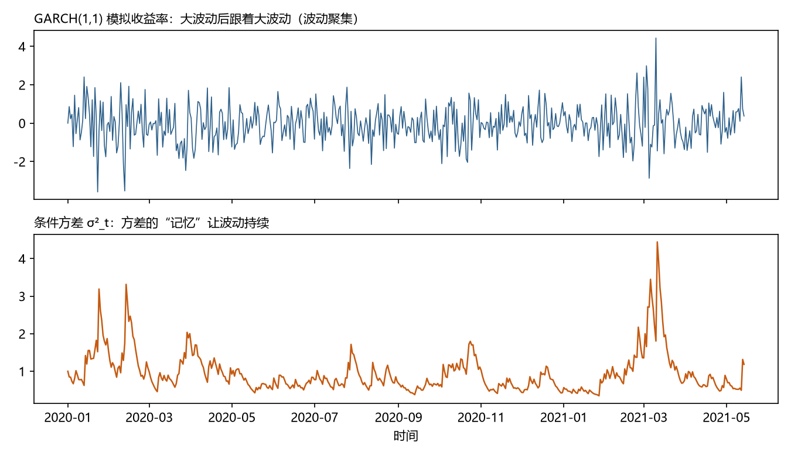

# 第 10 章 · 波动率建模：ARCH 与 GARCH

**本章目标**：学完本章后，你能①解释"波动聚集"现象；②说出 ARCH 与 GARCH 的核心思想（方差由过去决定）；③理解 GARCH(1,1) 的系数含义与持久性条件；④知道 GARCH 与第 3 章"厚尾"、第 9 章"隐藏状态"的联系。

---

## 10.1 动机：均值猜不准，但"风险"可以预测

金融收益率序列有一个反直觉的事实：

1. **均值几乎不可预测**：明天的涨跌方向，用历史几乎猜不准（市场有效性的体现）；
2. **但波动率高度可预测**：暴风雨往往连着暴风雨——**大波动后面跟着大波动**，这叫做**波动聚集（volatility clustering）**。

所以金融时间序列分析的重心不在"预测涨跌"，而在**预测风险（波动率）**——期权定价、风险管理（VaR）、组合配置全靠它。第 3 章说金融收益"厚尾"（极端值比正态多），**波动聚集正是厚尾的机制**：方差大时，极端值自然多。

> 一句话：**第 6~9 章都在建"均值模型"（预测水平），这一章建"方差模型"（预测风险）——方差不该是常数，它本身值得建模。**

---

## 10.2 是什么：从"方差恒定"到"方差自回归"

### 10.2.1 无条件方差 vs 条件方差

- **无条件方差**：整个序列"平均的波动"——常数（第 3 章学的那个方差）。
- **条件方差 σ²_t**：**在知道 t−1 时刻信息之后**，对 t 时刻方差的预测——它随时间变。

**关键认识**：无条件方差可以是常数，同时条件方差逐日变化——两者不矛盾。ARCH/GARCH 建模的是**条件方差**（用已知信息预测未知的波动）。

### 10.2.2 ARCH(q)：方差由过去的冲击决定

**ARCH（自回归条件异方差）**，Engle (1982)：

```
σ²_t = α₀ + α₁·ε²_{t−1} + α₂·ε²_{t−2} + … + α_q·ε²_{t−q}
```

- `σ²_t`：第 t 期条件方差（明天波动的预测）；
- `ε²_{t−k}`：过去冲击的**平方**（冲击用平方，因为正负冲击都增加波动）；
- `α₀ > 0`：基准方差；`α_k ≥ 0`：各期冲击的权重。

**直觉**：*昨天跌得很惨（ε² 大）→ 今天预期波动大。* 波动率有了"记忆"——大冲击把方差"顶起来"。

### 10.2.3 GARCH(p,q)：加上方差自己的历史

**GARCH**，Bollerslev (1986)，在 ARCH 里加"方差自身的滞后"：

```
σ²_t = α₀ + α₁·ε²_{t−1} + … + α_q·ε²_{t−q} + β₁·σ²_{t−1} + … + β_p·σ²_{t−p}
```

**GARCH(1,1)**（最常用）：

```
σ²_t = α₀ + α₁·ε²_{t−1} + β₁·σ²_{t−1}
```

- `α₁`：**新冲击**的影响（昨天的冲击对今天波动的影响）；
- `β₁`：**波动惯性**（昨天的波动对今天波动的影响）；
- **持久性 = α₁ + β₁**：越接近 1，波动越"赖着不走"（聚集越强）。要求 α₁+β₁ < 1 保证长期方差有限：
  **长期方差 = α₀ / (1 − α₁ − β₁)**。

**为什么加 β₁**：波动聚集往往持续很久，只靠 ARCH 要很多阶才够；GARCH 用"方差自己记得自己"一两项就够——又是**简约**（第 7 章的同一个故事）。

### 10.2.4 变体：不对称与状态空间

- **杠杆效应**：坏消息（负冲击）对波动的推升往往大于好消息——用对称 GARCH 会低估。**EGARCH**（Nelson 1991）和 **GJR-GARCH**（Glosten 等 1993）专门建模不对称。
- **随机波动率（SV）模型**：把波动率当作**隐藏状态**（第 9 章）——与 GARCH 的竞争路线，GARCH 假设方差完全由过去决定（确定函数），SV 假设方差本身有随机冲击。

---

## 10.3 怎么做：五步流程

### 第 1 步 · 数据准备：用收益率，不用价格
- **做什么**：把价格序列转成（对数）收益率：`r_t = ln(P_t) − ln(P_{t−1})`。
- **为什么**：价格有趋势（非平稳），收益率平稳得多；而且波动率建模天然针对收益。
- **会怎样**：得到一条围绕 0 波动、有聚集现象的收益率序列。

### 第 2 步 · 建均值模型，取残差
- **做什么**：对收益率拟合均值模型（常数或 ARMA），得到残差 ε_t。
- **为什么**：波动率建模的是"均值解释不掉的部分"的方差——残差才是"冲击"。
- **会怎样**：残差序列。若它呈聚集（看图 + 残差平方的自相关显著），进入下一步。

### 第 3 步 · 检验"方差在变吗"
- **做什么**：看残差平方的自相关（ACF），或跑 Engle 的 ARCH 检验（LM 检验）。
- **为什么**：如果方差恒定，残差平方应该无自相关；有自相关 = 有条件异方差 = 值得建 GARCH。
- **会怎样**：检验显著 → 建 GARCH；不显著 → 回到均值模型，别硬建。

### 第 4 步 · 拟合 GARCH
- **做什么**：软件极大似然估计系数；常用起点 GARCH(1,1)，用 AIC 比较更高阶。
- **为什么**：α₁、β₁ 从数据里估出来，才能预测明天的方差。
- **会怎样**：得到如 σ²_t = 0.1 + 0.2ε²_{t−1} + 0.7σ²_{t−1}；检查 α₁+β₁<1（持久性）。

### 第 5 步 · 使用预测的方差
- **做什么**：用 σ̂²_t 计算 ①明天的预测区间（更宽的区间 = 更危险的日子）；②**VaR**（在险价值）：`VaR ≈ −(μ̂ + z·σ̂)`，z 取分位数（如 95% 用 1.645）——"明天最多亏这么多"的统计说法。
- **为什么**：波动率预测是风险决策的原料。
- **会怎样**：得到"风险日历"：波动大的日子区间宽、VaR 大——**这是 GARCH 最直接的生产价值**。

---

## 10.4 完整示例：GARCH(1,1) 手算

模型：`σ²_t = 0.1 + 0.2·ε²_{t−1} + 0.7·σ²_{t−1}`（α₁+β₁=0.9，持久性高，波动"赖着不走"）。

- **长期方差** = 0.1/(1−0.2−0.7) = 0.1/0.1 = **1**（长期波动 100%）。
- 假设昨天冲击很大，ε²_{t−1} = 4（昨天 ±2 的大波动）：
```
σ²_t = 0.1 + 0.2×4 + 0.7×σ²_{t−1}
```
  - 若 σ²_{t−1} = 1：σ²_t = 0.1 + 0.8 + 0.7 = 1.6 → 明天波动预计 √1.6 ≈ 1.26（高于长期 1.0）——**大冲击把波动顶起来了**。
  - 再下一期：σ²_{t+1} = 0.1 + 0.2×(新冲击²) + 0.7×1.6 = 0.1 + 0.7×1.6 + 新冲击项 = 1.22 + …——**即使新冲击回归正常，0.7 的惯性也让高波动再持续几期**。这就是聚集的机制：β₁ 是"惯性旋钮"。

**效果**：你亲手看到了"波动为什么聚集"——**不是数据巧合，是 β₁ 让方差记得自己**。α₁+β₁=0.9 意味着一个冲击要过很久才"遗忘"。



*图 10.1 GARCH(1,1) 模拟：上图收益率"大波动后跟着大波动"（波动聚集）；下图条件方差 σ²_t 的"记忆"让波动持续——β₁ 是惯性旋钮的直观体现。*

---

## 10.5 这个环节可能遇到的问题（陷阱清单）

1. **对价格直接建 GARCH**：价格非平稳，GARCH 结果无意义。**先转收益率。**
2. **混用两种方差**：报告"长期方差=1"却说"明天波动√1.6"——两者都是对的，但一个是平均、一个是条件，**说清楚语境**。
3. **跳过均值模型**：残差不对，方差建模全错——**先均值、后方差，顺序不能乱**。
4. **对称模型硬套不对称数据**：有杠杆效应却用对称 GARCH → 系统性低估坏消息后的波动。**先看图/检验，不对称就上 EGARCH/GJR。**
5. **只报点预测**：GARCH 的价值在区间和 VaR——**只给 σ̂ 不给区间等于浪费。**
6. **阶数贪多**：GARCH(5,5) 拟合好但预测差——**GARCH(1,1) 起步，AIC 说话。**
7. **把"波动预测准"当"方向预测准"**：GARCH 不预测涨跌，只预测风险。**向决策者讲清楚：我们预测的是"多危险"，不是"涨还是跌"。**

---

## 10.6 相似问题与已有解决方案：历史回响

| 本环节的困难 | 谁遇到过 | 如何解决 | 本书对应 |
|---|---|---|---|
| "波动聚集怎么建模" | Engle (1982) 研究英国通胀 | **ARCH**：方差由过去冲击平方决定（诺贝尔经济学奖 2003） | 本章 |
| "ARCH 阶数太多" | Bollerslev (1986) | **GARCH**：加上方差自己的滞后，一两项就够 | 本章 |
| "坏消息影响更大" | Nelson (1991)；Glosten 等 (1993) | **EGARCH / GJR-GARCH**：不对称项 | 本章 |
| "波动率本身有随机性" | 金融计量 1980s | **随机波动率（SV）模型**：波动率当隐藏状态（状态空间） | 第 9 章 |
| "风险怎么量化" | 风险管理（1990s，J.P. Morgan RiskMetrics） | **VaR / 预期损失 ES**：把 σ̂ 换算成"最多亏多少" | 第 19 章 |
| "深度学习的波动率模型" | 2010s | 神经网络 GARCH 混合、LSTM 波动率预测 | 第 14 章 |

**核心启示**：ARCH/GARCH 是"**二阶结构建模**"的起点——均值之外，方差也值得建模、也可以预测。金融风险管理的一切（VaR、期权定价、压力测试）都站在它上面。

---

## 10.7 本章小结

1. **波动聚集**：大波动后跟大波动；它是金融收益"厚尾"的机制。
2. **ARCH**：方差 = 常数 + 过去冲击平方的加权——"大冲击顶起方差"。
3. **GARCH(1,1)**：σ²_t = α₀ + α₁ε²_{t−1} + β₁σ²_{t−1}；**α₁=新冲击，β₁=惯性，α₁+β₁=持久性（<1 且越接近 1 越聚集）**；长期方差 = α₀/(1−α₁−β₁)。
4. 流程：**收益率 → 均值残差 → ARCH 检验 → 拟合 GARCH → 用 σ̂ 算区间/VaR**。
5. 变体：EGARCH/GJR 处理不对称；SV 把波动率当隐藏状态（接第 9 章）。

下一章从单变量走向多变量：**两个或多个序列一起建模**——VAR、协整与误差修正。第 11 章 · 多变量时间序列：VAR、协整与误差修正。

---

## 10.8 练习与自测

1. ★ 什么是波动聚集？用一句话解释。（提示：10.1）
2. ★ GARCH(1,1) 中 α₁ 和 β₁ 各代表什么？（提示：10.2.3）
3. ★★ 模型 σ²_t = 0.2 + 0.1ε²_{t−1} + 0.8σ²_{t−1} 的持久性和长期方差是多少？（提示：10.4）
4. ★★ 为什么"坏消息后波动往往比好消息更大"需要用 EGARCH？（提示：10.2.4）
5. ★★★ 用 `arch` 库（Python）对任意股票收益率拟合 GARCH(1,1)，报告 α₁、β₁、持久性，并用预测的 σ̂ 算 95% VaR。（提示：10.3 五步）

**简答提示**：1 大波动后跟着大波动，波动率有记忆；2 α₁=新冲击的影响，β₁=波动惯性；3 持久性=0.9，长期方差=0.2/(1−0.9)=2；4 对称 GARCH 对正负冲击等权，会低估负冲击推升的波动，EGARCH/GJR 允许不对称；5 略（关注 α₁+β₁ 是否接近 1——金融收益率通常 0.95+，聚集强）。

---

## 10.9 本章审阅记录

| 审阅项 | 结论 | 问题与修订 |
|---|---|---|
| R1 零基础可理解性 | ✔ 通过（自查） | α₀、α₁、β₁、ε²、σ²_t 全部逐项解释；无条件/条件方差先讲清区别；"惯性旋钮"类比 |
| R2 为何行动 | ✔ 通过 | 五步流程每步有"为什么"（先均值后方差、检验必要、VaR 用途） |
| R3 效果明确 | ✔ 通过 | 10.4 手算展示大冲击如何把 σ² 从 1.0 顶到 1.6 并持续 |
| R4 陷阱覆盖 | ✔ 通过 | 7 条：价格 vs 收益率、两种方差、顺序、不对称、只报点、阶数、方向 vs 风险 |
| R5 相似问题映射 | ✔ 通过 | 6 行映射（ARCH→GARCH→EGARCH→SV→VaR→深度学习） |
| R6 示例可复现 | ✔ 通过 | 长期方差=1、1.6、1.22 手算验算；练习 3（持久 0.9、长期方差 2）验算 |
| R7 章节衔接 | ✔ 通过 | 开头接第 3 章厚尾，结尾预告第 11 章多变量 |
| R8 练习有效 | ✔ 通过 | 5 题覆盖定义、系数、计算、不对称、实践 VaR |

**审阅方式**：作者自查（R1–R8 逐项）+ 数字验算；本章为经典计量章，未启用子代理。
