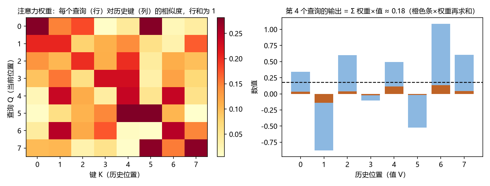

# 第 15 章 · Transformer 与长序列预测：改良脉络与线性之争

**本章目标**：学完本章后，你能①用"查字典"理解注意力机制；②说出 Transformer 用于时序的三个适配难题（置换不变、二次复杂度、结构先验）；③逐篇说出 Informer → Autoformer → PatchTST → iTransformer 各自**改良了什么、解决什么问题**；④理解 LTSF-Linear"线性反杀"的教训与影响。

---

## 15.1 动机：RNN 的两个天花板，和一次"反杀"

第 14 章 RNN/LSTM 有两个天花板：**串行计算慢**（必须一步步走）和**长记忆靠门控硬扛**。2017 年在自然语言处理中发明的 **Transformer** 用**注意力**解决了这两个问题：一步到位"看"全部历史，且全部并行。

但把 Transformer 搬到时间序列，2023 年发生了一件大事：一篇论文用**一个单层线性模型**在 9 个真实数据集上**全面击败**当时最复杂的 Transformer 预测模型——这就是著名的**线性反杀**。它逼着整个领域回答：*"Transformer 到底给时序带来了什么？"*

> 一句话：**注意力是"学出来的加权平均"（第 6 章指数平滑的终极版），但时序有自己的结构（顺序、趋势、季节、变量关系）——围绕"怎么把结构还给 Transformer"，诞生了一条清晰的改良脉络；而线性反杀提醒所有人：基线是底线。**

---

## 15.2 是什么：注意力与三个适配难题

### 15.2.1 注意力机制（attention）——"学出来的加权"

Transformer 的核心是**缩放点积注意力**，直觉是**查字典**。先看它的五步计算（理解流程即可，细节软件代劳）：

```
① 输入：L 个历史位置，每个位置是一个向量
② 投影：每个位置分别乘三个可学习矩阵，得到三样东西——
       查询 Q（想找什么）、键 K（是什么）、值 V（提供什么）
③ 相似度：每个 Q 与每个 K 做"点积"（对应位置相乘再求和），
       得到一个相似度分数——这就是"匹配度"
④ 缩放归一化：分数除以 √d（防数值过大），再用 softmax 变成权重（和为 1）
⑤ 输出：所有位置的 值V 按权重加权求和 → 该位置的输出
```

三个角色：
- **查询（Query）**：你想找什么（"未来该关注什么历史模式？"）；
- **键（Key）**：每个历史位置"是什么"（供匹配）；
- **值（Value）**：每个历史位置"提供什么内容"（取出来用）。

**直觉（查字典）**：你（查询 Q）在词典里找和"查询词"最像的条目（键 K），取出对应的解释（值 V）。匹配越像，权重越大。

**两个常见疑问**：①为什么不直接取"最像的那一条"？因为加权平均**可微**（能训练）、且能同时参考多个相关模式——"昨天"和"去年同期"都像，两个都参考比只取一个信息更多。②权重到底是"算的"还是"学的"？**匹配公式是固定的，但投影矩阵 W_Q/W_K/W_V 是训练学出来的**——模型学会"什么样的模式值得被重视"，权重由公式实时算出。

**为什么对时序重要**：输出是**所有历史位置的加权和**，权重由数据学出来——这正是第 6 章指数平滑的终极版：*权重不再是固定的指数衰减，而是模型自己决定"该多看重昨天、多看重去年同期"。* 注意力能同时建立任意两个位置的关系（**长依赖**），且所有位置**并行**计算（不串行）。



*图 15.1 左：注意力权重矩阵（行=查询 Q，列=历史键 K，颜色越深权重越大，行和为 1）；右：第 4 个查询的输出 = 各位置值 V 按权重加权求和（橙色条×权重累加，虚线为结果）。*

### 15.2.2 难题 1：置换不变性（permutation invariance）

注意力对"顺序"天生不敏感——把输入打乱，输出几乎不变。为什么？因为输出是"按内容相似度对所有位置加权求和"：求和与顺序无关（加法交换律），而且输入向量里**没有"我是第 3 个时刻"这种编号**，模型只能区分"内容不同"，无法区分"位置不同"。但时序的顺序就是一切（第 1 章特征 1）。解法：**位置编码**——给每个位置的向量加上一个"代表位置号"的向量，相当于给每个 token 贴一张"第几号"的标签。**这是第一处"把时序结构还给 Transformer"的补丁。**

### 15.2.3 难题 2：二次复杂度 O(L²)

L 个位置两两算相似度，计算量随 L 的**平方**增长——L=1000 时约 100 万次配对，L=2000 时约 400 万次，再长就"算不动"（显存和时间都爆炸）。解法：让注意力"稀疏"（只算重要的配对）或"线性化"（用技巧把平方降成线性）——Informer 的 ProbSparse 是稀疏路线最早的代表之一（另有独立的线性注意力路线）。

### 15.2.4 难题 3：时序结构先验（趋势、季节、变量关系）

注意力是"通用相关器"（只看"内容像不像"，不管结构），但时序有**趋势、季节、变量间关系**这些结构（第 2、11 章）。通用 Transformer 不"知道"这些——需要显式塞进去（分解模块、patch、通道策略、倒置）。**整个改良脉络就是"把结构越塞越多"的过程。**

---

## 15.3 改良脉络：四篇论文，各自改了什么

这是本章核心——**逐篇看"改良在何处、解决什么问题"**：

### 15.3.1 Informer（Zhou 等，AAAI 2021）——解决"算不动"

- **改良点 1：ProbSparse 稀疏注意力**。观察：注意力权重其实高度稀疏（少数"活跃"的 Q 决定了大部分输出）。做法：只对"重要"的查询算完整注意力，其余用近似。
- **解决什么**：把复杂度从 O(L²) 降到 **O(L log L)**——长序列第一次变得可行。
- **改良点 2：蒸馏（distilling）**：层层把序列长度减半、信息浓缩——**解决什么**：进一步压低计算量（配合稀疏注意力，长序列才跑得动）。
- **改良点 3：生成式 decoder**：一步输出整个预测段——**解决什么**：自回归预测要"逐点递归"（慢、误差逐点累积），一步输出可并行、误差不累积。
- **效果**：长序列预测（LTSF）成为显学；但注意力仍是"通用"的，没塞时序结构。

### 15.3.2 Autoformer（Wu 等，NeurIPS 2021）——把"分解"塞进模型

- **改良点 1：序列分解内嵌**。把第 2 章的"趋势/季节分解"变成**网络内部的模块**（每层都分解一次：趋势走缓慢路径，季节走高频路径）。
- **解决什么**：让模型显式区分"趋势"与"季节"——把经典结构先验（第 2 章）变成架构。
- **改良点 2：自相关机制替代注意力**。把第 4 章的 ACF 从"一个滞后给一个数"推广成"序列与平移 k 后的子序列逐段算相似度"，选最相关的 top-k 个周期滞后做加权平均——周期依赖（如"去年 12 月"）直接由数据算出，比通用注意力更贴合周期结构。
- **效果**：结构先验进入 Transformer；但自相关仍是"时间维度"的匹配，多变量关系还没管。

### 15.3.3 PatchTST（Nie 等，ICLR 2023）——分片 + 通道独立

- **改良点 1：分片（patching）**。把时间轴切成**小片**（如 16 步一片）当作"词"输入——呼应 NLP 的 token。作用：①注意力计算量降为原来的 1/P²（P=片长，token 数从 L 变成 L/P，P=16 时约 1/256）；②每个片是"局部模式"（比单点更稳）；③视野变长（一个 token 覆盖 P 步，注意力关系建立在"片"上，能跨越更长时间）。
- **改良点 2：通道独立（channel independence）**。多变量数据中，每个变量**单独**过同一套网络（不混通道）。
- **解决什么**：①二次复杂度进一步降（片数远小于步数）；②避免"通道间噪声互相干扰"——变量多时"各自为政"反而更稳。
- **改良点 3：掩码自监督预训练**——用"挖掉一段、预测一段"预训练（第 18 章基础模型也这么干）。
- **效果**：patch 成为后续几乎所有模型的标准组件；**但它刻意不管变量关系**——这正是 iTransformer 的切入点。

### 15.3.4 iTransformer（Liu 等，ICLR 2024）——把注意力"倒过来"

- **改良点：倒置（inverted）结构**。输入形状从"（时间 L, 变量 C）"转置成"（变量 C, 时间 L）"：**每个变量当"一个 token"**（token 内容是该变量的整段历史，先线性压缩成向量），注意力在 C 个变量 token 间跑，学**变量间关系**（第 11 章 VAR 干的事）；每个变量"随时间演化"的部分交给 token 内部的前馈网络（FFN）学。（注：原论文用整段历史做线性投影、不切 patch——把 patch 叠加上去是工程可选做法，非原配。）
- **解决什么**：直接回应"线性反杀"——**变量相关结构**（如温度↔负荷）是 Transformer 相对线性模型真正的增量价值所在；同时解决了"多变量在时间维上互相干扰"的问题。
- **效果**：在多变量长序列基准上重回 SOTA（SOTA＝state-of-the-art，当前最好成绩；注意这是在 LTSF-Linear 引发的"第二轮"基准上，与第一轮 Transformer 全盛期不是同一时段）；**"注意力应该用在哪一维"成为设计语言的新焦点**（时间维 vs 变量维）。

**脉络总结表**：

| 论文 | 改了什么 | 解决的难题 | 关键设计 |
|---|---|---|---|
| Informer | 稀疏注意力 | 二次复杂度 | ProbSparse + 蒸馏 + 生成式 decoder |
| Autoformer | 分解内嵌 + 自相关 | 结构先验（趋势/季节） | 每层分解 + ACF 加权 |
| PatchTST | 分片 + 通道独立 | 计算与通道干扰 | patch 当 token + 通道独立 + 掩码预训练 |
| iTransformer | 倒置注意力 | 变量关系（回应线性） | 变量维注意力 + 时间维 FFN |

---

## 15.4 线性反杀：LTSF-Linear 的教训

**LTSF-Linear**（Zeng 等，AAAI 2023）：一个**单层线性模型**——把窗口内最近 L 个值直接线性加权预测未来，在 9 个真实数据集（ETT、Weather、Exchange…）上**全面超过当时所有复杂 Transformer**。

**为什么线性能赢？**（拆解四因；注：严格说，在 ETT/Exchange 等基准上领跑的是论文里的 **DLinear**——"分解 + 线性"变体，单层线性是其简化版，下文统称"线性模型"）：
1. **注意力置换不变**：位置编码只是"补丁"，线性模型对顺序的利用反而更直接；
2. **基准序列的模式相对简单**：以 ETT 为例——15 分钟采样的电力变压器数据，强日/周周期、高噪声，预测 96~720 步时，用"最近一天（96 步）的线性加权"就能抓住主要变化。线性容量刚好够用，Transformer 的容量用不上；
3. **数据效率**：Transformer 参数多、需要大数据；基准数据集小，线性学得更好；
4. **注意力的"摊平"倾向**：长序列下注意力权重容易摊平——接近对所有位置均匀加权，等于把信号"平均化"、丢失"哪个滞后最关键"的细节；线性模型每个滞后有独立权重，结构更直接。

**影响（持续至今）**：
- **新论文必须对比线性基线**——成了审稿的隐形门槛；
- PatchTST、iTransformer 的"分片/倒置"都把这当作设计动机（回应）；
- 统计方法（ETS/ARIMA）在评测中重新被当作标准对照。

**正确的心态**：不是"Transformer 没用"，而是**"什么时候用、用在哪一维、有没有塞进结构"**——iTransformer 证明在"变量关系"上 Transformer 有真正的增量。

---

## 15.5 怎么做：五步流程

### 第 1 步 · 判断任务值不值得
- **做什么**：问三个问题：序列够长吗（几百步+）？滑窗后训练样本数够大吗（上万）？有多变量关系吗？
- **为什么**：Transformer 的收益在长序列/大数据/变量关系；短序列小数据上线性与统计更稳。
- **会怎样**：多数"否"→ 回到第 6~13 章；至少一个"是"→ 继续。

### 第 2 步 · 数据与预处理
- **做什么**：滑窗 + **RevIN 可逆实例归一化**（逐实例归一化、预测后还原——解决归一化泄漏）+ patch 设定。（patch 是**可独立叠加**的组件：PatchTST 必须配 patch；iTransformer 默认不 patch，见 15.3.3/15.3.4。）
- **为什么**：RevIN 是"归一化泄漏"的正解（第 14 章陷阱 2 的修复）；patch 是效率与稳定性的关键。
- **会怎样**：干净的样本与明确的设计参数（patch 长度、通道策略）。

### 第 3 步 · 选架构与基线
- **做什么**：按第 15.3 脉络选（变量关系重要 → iTransformer；单变量长序列 → PatchTST；趋势季节强 → Autoformer 思想）；**同时一定跑线性基线与统计基线**。
- **为什么**：第 15.4 的教训——不对比基线等于自嗨。
- **会怎样**：模型 + 基线两套结果。

### 第 4 步 · 训练与评估
- **做什么**：三集合纪律（训练/验证/测试）、时间切分、早停。
- **为什么**：铁律（第 13、14 章）。
- **会怎样**：可信的测试集指标。

### 第 5 步 · 结论
- **做什么**：对比表格（Transformer vs 线性 vs 统计），报告提升与代价。
- **为什么**：决定模型去留。
- **会怎样**：明确的"赢了什么、在哪个数据集、值得吗"。

---

## 15.6 完整示例：一个"变量关系"驱动的选择

- **任务**：预测电力负荷（有温度、湿度、风速、节假日四个相关变量，分钟级 3 年数据，需 24h 预测）。
- **发现**：负荷与温度强相关（变量关系）、与去年同期强相关（季节）、序列极长（分钟级 3 年、需 24h 预测＝1440 步，属超长 horizon，示例仅为教学示意）。
- **选择**：iTransformer（变量维注意力 + RevIN；季节模式由数据与 RevIN 自动处理，选型的关键在"变量关系"这一条，见 15.3.4），基线为线性模型与 Holt-Winters。
- **结果**：iTransformer 测试集 MAE 比线性低 8%、比 Holt-Winters 低 15%——**变量关系的建模确实是增量**；在单变量的"某小区用水量"任务上，三者几乎打平，iTransformer 的优势消失。

**效果**：同一模型在"有变量关系"的任务胜出、在"纯单变量"任务无优势——**印证了第 15.4 的判断：Transformer 的增量在结构（变量关系、长依赖），不在通用容量。**

---

## 15.7 这个环节可能遇到的问题（陷阱清单）

1. **不对比线性基线**：审稿与领导都会问"比线性好多少？"——**没跑基线就别谈结果。**
2. **置换不变性误用**：输入顺序被打乱还指望模型学"先后"——**位置编码/顺序信息必须显式保留。**
3. **patch 与通道策略拍脑袋**：patch 长度影响感受野与计算；通道独立 vs 混合影响变量关系建模——**按任务选，并报告敏感性。**
4. **归一化泄漏**：用全序列归一化 → 虚高成绩。**RevIN 或只用训练段统计。**
5. **只报最佳结果**：报告"最好的那次 seed"是自欺——**报告多次运行的均值±标准差。**
6. **无视复杂度**：长序列硬用 O(L²) 注意力——**选稀疏/线性注意力或 Mamba（第 16 章）。**
7. **把"在基准赢"当"在业务赢"**：ETT 等基准模式简单；真实业务的漂移、异常、样本分布变化，Transformer 未必扛得住——**上线前做样本外压力测试。**

---

## 15.8 相似问题与已有解决方案：历史回响

| 本环节的困难 | 谁遇到过 | 如何解决 | 本书对应 |
|---|---|---|---|
| "长依赖+并行" | Vaswani 等 (2017) | **Transformer 注意力**（NLP 起源） | 本章 |
| "二次复杂度" | Informer (2021)；后续 | ProbSparse、线性注意力、**Mamba/SSM**（近线性） | 本章；第 16 章 |
| "趋势/季节结构" | Autoformer (2021) | 分解模块 + 自相关 | 第 2、4 章 |
| "计算与通道干扰" | PatchTST (2023) | patch + 通道独立 + 掩码预训练 | 本章 |
| "变量关系" | iTransformer (2024) | 倒置注意力（变量维） | 第 11 章 VAR |
| "线性反杀" | LTSF-Linear (2023) | 反思：结构先验与基线纪律 | 第 6、13 章 |

**核心启示**：改良脉络的本质是**"把时序的结构一点点还给 Transformer"**——复杂度（Informer）、分解（Autoformer）、局部性与通道（PatchTST）、变量关系（iTransformer）。而线性反杀是"结构先验 vs 通用容量"之争的清醒剂：**没有结构先验的通用模型，在小数据上输给有结构先验的简单模型。**

---

## 15.9 本章小结

1. **注意力** = 学出来的加权平均（指数平滑终极版）；三个适配难题：置换不变（位置编码）、二次复杂度、结构先验缺失。
2. **改良脉络**：Informer（稀疏注意力，解决复杂度）→ Autoformer（分解+自相关，塞进结构）→ PatchTST（patch+通道独立，效率与稳定）→ iTransformer（倒置注意力，变量关系）——**每篇都在把时序结构还给 Transformer**。
3. **线性反杀**（LTSF-Linear）：单层线性击败复杂 Transformer——原因：置换不变、基准简单、数据效率、平均化倾向；影响：**线性/统计基线成为审稿门槛**。
4. 使用决策：**长序列 + 大数据 + 变量关系**才值得；三集合纪律 + RevIN 不可少。
5. 正确心态：**不是"Transformer vs 线性"，而是"结构放对位置没有"。**

下一章进入生成式与概率预测：**扩散模型、神经 ODE 与 N-BEATS**——从"预测一个数"到"生成整个未来分布"。第 16 章 · 概率与生成式预测。

---

## 15.10 练习与自测

1. ★ 用"查字典"解释注意力的 Q/K/V。（提示：15.2.1）
2. ★ 置换不变性为什么对时序是问题？（提示：15.2.2）
3. ★★ Autoformer 相对 Informer 改良了什么？解决什么问题？（提示：15.3.2）
4. ★★ 为什么单层线性能击败复杂 Transformer？（提示：15.4 四因）
5. ★★★ 用 `TSLib`（清华）复现"PatchTST vs DLinear"在 ETT 数据集上的对比，报告 MSE 与 MAE 并解读差异。（提示：15.5 五步；`git clone https://github.com/thuml/Time-Series-Library` 后按 README 装依赖，数据由脚本自动下载；两者实现都在 `models/` 下）

**简答提示**：1 查询=想找什么，键=历史位置是什么，值=历史位置提供什么；输出=按匹配度加权的值；2 注意力按内容相似加权、不按位置——时序顺序就是信息，打乱输入输出不变就废了；3 分解模块（趋势/季节）+自相关替代注意力——把经典结构先验塞进网络；4 置换不变、基准模式简单（线性容量刚好够用）、数据量小（Transformer 学不好，数据效率低于线性）、长序列下注意力权重摊平丢失细节；5 略（注意 DLinear 在多数 ETT 上赢或平，这正是线性之争的现场版）。

---

## 15.11 本章审阅记录

| 审阅项 | 结论 | 问题与修订 |
|---|---|---|
| R1 零基础可理解性 | ✔ 通过（修订后） | 注意力补五步计算流程（W_Q/W_K/W_V、点积、缩放、softmax）；补"加权 vs 取最像""权重算的学的"两问；置换不变补机制；SOTA/通用相关器展开 |
| R2 为何行动 | ✔ 通过 | 四篇论文全部补齐"改良点—解决什么"一一对应（Informer 蒸馏/生成式 decoder、iTransformer 倒置形状、Autoformer 自相关推广） |
| R3 效果明确 | ✔ 通过 | O(L²) 补数字（L=1000→100 万配对）；PatchTST 计算量修正为 1/P²；iTransformer 补输入形状示意 |
| R4 陷阱覆盖 | ✔ 通过 | 七条保留；线性基线纪律强调 |
| R5 相似问题映射 | ✔ 通过 | 6 行映射含 Mamba 预告；论文元数据子代理核对全部正确 |
| R6 示例可复现 | ✔ 通过 | 修复 2 处事实性偏差：iTransformer 原论文不切 patch（注明工程可选）、线性之争领跑者为 DLinear（补注）；15.4 因 4 重写（权重摊平丢细节，去掉自相矛盾的因果链） |
| R7 章节衔接 | ✔ 通过 | 15.1 措辞修正（"在 NLP 中发明的"）；15.3.4 补"第二轮基准"消除与线性反杀的表面矛盾 |
| R8 练习有效 | ✔ 通过 | 练习 5 补 MSE/MAE 与 TSLib 安装指引；简答 4 措辞与正文统一 |

**审阅方式**：作者自查 + 独立"模拟零基础读者"子代理通读（反馈 14 条：地基性缺失 1、事实性偏差 2、逻辑矛盾 2、数字错误 1、衔接 5、练习 3），全部处理。
